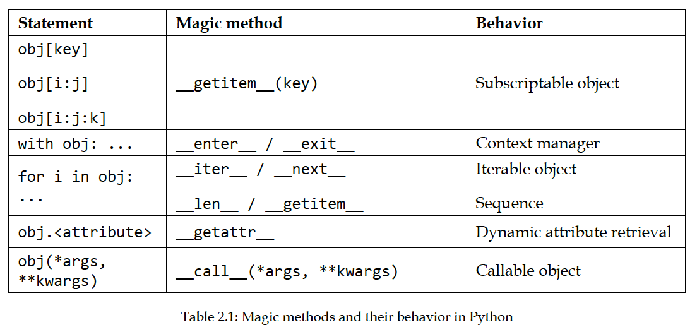

Nathan George | Tink AB | July 24, 2022

# Summary of "Clean Code in Python"

[comment]: # (!!!)


https://github.com/PacktPublishing/Clean-Code-in-Python-Second-Edition


[comment]: # (!!!)

Code is generally written to communicate with machines, but we also largely use it to communicate with other developers. Hence why clean and standardized code is important.

[comment]: # (!!!)

Consistent code formatting makes searching for things easier. PEP8 is the standard in Python. Example:
searching for an argument named location: `grep -nr "location="`
searching for a variable called "location" being set: `grep -nr "location = "`

[comment]: # (!!!)

"code comments are evil"

Aim to have as few code comments as possible.

"comments in code are a symptom of our
inability to express our code correctly"

Code should be self-documenting:
- variable names describe what they are
- function names describe what they do

Try to rewrite comments with code (e.g. changing variable name, adding a function)

"Mercilessly" delete commented-out code. It can be saved in a Git history instead.

[comment]: # (!!!)

Annotations can be used to have built-in docs in code.

Consider these two:

```python
def launch_task(delay_in_seconds):
...
```

```python
Seconds = float
def launch_task(delay: Seconds):
...
```

In the second, we see that the delay is in seconds, and can be fractional.

We can also use these annotations for automated checks (generate docs, run validations, enforcec checks). E.g. `locate.__annotations__` gives a dict with inputs/outputs of a function and their types.

[comment]: # (!!!)

# Automated checks

Add to build (CI)
- type consistency (mypy, pytype)
    - mypy checks defs against args
    - pytype checks if types at runtime will be correct
- linting
    - pycodestyle, flake8, pylint, Coala
    - pylint maybe best for Python, Coala for multiple languages
- autoformatting
    - black (more restrictive, subset of PEP8), autopep8, yapf (highly customizable, partial formatting of files)
    - can use "milestone" commit to apply black to everything, or apply black to each commit and rewrite history
    - yapf can be used to only format new additions to code
- use a makefile for easy-to-use CI steps that can be reused and modified

[comment]: # (!!!)

Idioms: a way to write code for a particular task
Design patterns: high-level ideas for implementing something, independent from the language

Pythonic idioms:
- better performance
- more compact
- easier to understand

[comment]: # (!!!)

# Context managers (Python idiom)
- `contextlib` module, `contextmanager` decorator, `contextlib.ContextDecorator` for inheritance
- e.g. `with` - these have `__enter__` and `__exit__` methods
    - `__exit__` always called at the end or if there is an exception
- used for opening files, connections, managing resources
- e.g. backup database
- `__exit__` takes values from exception, if no exception, they are `None`

```python
class DBHandler:
    def __enter__(self):
        stop_database()
        return self
    
    def __exit__(self, exc_type, ex_value, ex_traceback):
        start_database()

with DBHandler():
    db_backup()
```

[comment]: # (!!!)

# List comprehensions

Use instead of loops when it increases readability and reliability (also slightly faster but not noticible). Example:

```python
def collect_account_ids_from_arns(arns: Iterable[str]) -> Set[str]:
    collected_account_ids = set()
    for arn in arns:
    matched = re.match(ARN_REGEX, arn)
    if matched is not None:
    account_id = matched.groupdict()["account_id"]
    collected_account_ids.add(account_id)
    return collected_account_ids
```

```python
def collect_account_ids_from_arns(arns):
    matched_arns = filter(None, (re.match(ARN_REGEX, arn) for arn in arns))
    return {m.groupdict()["account_id"] for m in matched_arns}
```

[comment]: # (!!!)

# PEP572 and assignment expressions
Allows for even more compact list/dict/set comprehensions:

```python
def collect_account_ids_from_arns(arns: Iterable[str]) -> Set[str]:
    return {
    matched.groupdict()["account_id"]
    for arn in arns
    if (matched := re.match(ARN_REGEX, arn)) is not None
    }
```

[comment]: # (!!!)

# Private, public, protected
Other languages have private and protected functions, but everything in Python is public. A convention is to begin a function name with an underscore if intended to be private.

If it's not intended to be used externally, keep it private. This makes refactoring the code easier, since the private methods should only be used within the class and not all over the place in many different ways.

Double underscore doesn't make it private, but is a misconception. Instead, it will get "name mangled" like `"_<class-name>__<attributename>`. Don't use this, and don't use "dunder" methods (2 underscore before/after) for methods. Just use a single underscore and respect the convention that those are private attrs/methods.


[comment]: $ (!!!)

We can set validation for properties like so (e.g. in a class):

```python
@property
    def latitude(self) -> float:
    return self._latitude

@latitude.setter
def latitude(self, lat_value: float) -> None:
    if lat_value not in range(-90, 90 + 1):
        raise ValueError(f"{lat_value} is an invalid value for
            latitude")
    self._latitude = lat_value
```

[comment]: $ (!!!)

# Command and query separation of objects

"The command and query separation principle states that a method of an object should either answer to something or do something, but not both."

"don't do more than one thing in a method"

"If you want to assign something and then check
the value, break that down into two or more statements."

"try to make properties idempotent" - e.g. we can get properties multiple times and not change the state


[comment]: $ (!!!)

# dataclass decorator

Possible to use this to avoid some __init__ boilerplace, although this is a confusing example. Best suited "for data classes would be all those places when we need
to use objects as data containers or wrappers, namely situations on which we used
named tuples or simple namespaces."

```python
from typing import List
from dataclasses import dataclass, field

R = 26

@dataclass
class RTrieNode:
    size = R
    value: int
    next_: List["RTrieNode"] = field(
    default_factory=lambda: [None] * R)
    
    def __post_init__(self):
        if len(self.next_) != self.size:
        raise ValueError(f"Invalid length provided for next list")
```

[comment]: $ (!!!)

# Making your own iterables

Needs:
- `__next__` or `__iter__`
- `__len__` and `__getitem__`

```python
from datetime import timedelta

class DateRangeIterable:
    """An iterable that contains its own iterator object."""
    def __init__(self, start_date, end_date):
        self.start_date = start_date
        self.end_date = end_date
        self._present_day = start_date

    def __iter__(self):
        return self

    def __next__(self):
        if self._present_day >= self.end_date:
            raise StopIteration()
        today = self._present_day
        self._present_day += timedelta(days=1)
        return today
```

```python
>>> from datetime import date
>>> for day in DateRangeIterable(date(2018, 1, 1), date(2018, 1, 5)):
... print(day)
...
2018-01-01
2018-01-02
2018-01-03
2018-01-04
```

First calls the iter method, which indicates it's iterable by returning itself. Then calls next until it gets a StopIteration exception.

One issue is if the iterable has been used, you can't use it again without recreating it. We can return a new instance of it or a generator to fix this:

```python
def __iter__(self):
    current_day = self.start_date
    while current_day < self.end_date:
        yield current_day
        current_day += timedelta(days=1)
```

Then we can create it multiple times and use it. Called a "container iterable".

```python
>>> r1 = DateRangeContainerIterable(date(2018, 1, 1), date(2018, 1, 5))
>>> ", ".join(map(str, r1))
'2018-01-01, 2018-01-02, 2018-01-03, 2018-01-04'
>>> max(r1)
datetime.date(2018, 1, 4)
```

[comment]: $ (!!!)

# Iterable vs sequence

An iterable, like we saw before, uses less memory but more CPU. To get the nth value, we have to iterate n times. Sequences store it all in memory so use less CPU but more memory. We can define the len and get_item methods, but not the iter method to create a sequence:

```python
class DateRangeSequence:
    def __init__(self, start_date, end_date):
        self.start_date = start_date
        self.end_date = end_date
        self._range = self._create_range()
    
    def _create_range(self):
        days = []
        current_day = self.start_date
        while current_day < self.end_date:
            days.append(current_day)
            current_day += timedelta(days=1)
        return days

    def __getitem__(self, day_no):
        return self._range[day_no]

    def __len__(self):
        return len(self._range)
```

Now we can index the item instead of looping through each time to get different elements.

[comment]: $ (!!!)

# Container objects

Like a set, has a `x in y` method from `__contains__`
- Implement the `__contains__` method, which gets called with `in`

[comment]: $ (!!!)

# __getattr__

Used when getting attributes that aren't part of the class.


```python
class DynamicAttributes:
    def __init__(self, attribute):
        self.attribute = attribute

    def __getattr__(self, attr):
        if attr.startswith("fallback_"):
            name = attr.replace("fallback_", "")
            return f"[fallback resolved] {name}"
        raise AttributeError(
            f"{self.__class__.__name__} has no attribute {attr}"
        )
```

"if you're creating a wrapper object on top
of another one by means of composition, and you want to delegate most of the
methods to the wrapped object, instead of copying and defining all of those methods,
you can implement __getattr__ that will internally call the same method on the
wrapped object."

"Use the __getattr__ magic method when you see an opportunity to avoid lots of
duplicated code and boilerplate, but don't abuse this method"

- code compactness vs maintainability

[comment]: $ (!!!)

# Callable objects

"The magic method __call__ will be called when we try to execute our object as if
it were a regular function. Every argument passed to it will be passed along to the
__call__ method."

If we want to save the state between calls. Handy for decorators.

```python
from collections import defaultdict

class CallCount:
    def __init__(self):
        self._counts = defaultdict(int)

    def __call__(self, argument):
        self._counts[argument] += 1
        return self._counts[argument]
```

```python
>>> cc = CallCount()
>>> cc(1)
1
>>> cc(2)
1
>>> cc(1)
```

[comment]: $ (!!!)



Use these by declaring a class from `collections.abc` with the corresponding type, and provides methods and types for what you want.

[comment]: $ (!!!)

# Caveats, things to avoid

- mutable default args
- use `collections` module to extend built-in types
[comment]: $ (!!!)

# Mutable default args

```python
def wrong_user_display(user_metadata: dict = {"name": "John", "age":
30}):
    name = user_metadata.pop("name")
```

Dict is created once when the file is run. Instead, do this:

```python
def user_display(user_metadata: dict = None):
    user_metadata = user_metadata or {"name": "John", "age": 30}
    name = user_metadata.pop("name")
```


[comment]: $ (!!!)

# use `collections` module to extend built-in types

"in CPython
(a C optimization), the methods of the class don't call each other (as they should),
so if you override one of them, this will not be reflected by the rest"

"you might want to override __getitem__, and
then when you iterate the object with a for loop, you will notice that the logic you
have put on that method is not applied."

"Don't extend directly from dict; use collections.UserDict
instead. For lists, use collections.UserList, and for strings, use
collections.UserString."

```python
from collections import UserList

class GoodList(UserList):
    def __getitem__(self, index):
        value = super().__getitem__(index)
        if index % 2 == 0:
            prefix = "even"
        else:
            prefix = "odd"

        return f"[{prefix}] {value}"
```
[comment]: $ (!!!)

# Asynchronous code

The advantage is to not block I/O operations.

Async modules/libraries:
- asyncio
- trio
- curio

Uses *coroutines*. Like functions, but declared with something like `async def`. When calling another one from inside a coroutine, use `await`. Then the "event loop" continues.

```python

async def mycoro(*args, **kwargs):
    # … logic
    await third_party.coroutine(…)
    # … more of our logic

result = await mycoro(…)
```

Or

```python
import asyncio

asyncio.run(mycoro(…))
```

[comment]: $ (!!!)

# Software design

Want to have software:
- secure
- high performance
- high reliability
- easy mantainability

Types of design discussed here:
- design by contract (DbC)
- defensive programming
- separation of concerns

[comment]: $ (!!!)

# Design by Contract (DbC)

Makes it easier to spot where errors are occuring.
Rules that define what every part of code expects to be able to function.
What the caller is expecting from the parts of code.
**The contract**
entails preconditions and postconditions, and sometimes invariants and side effects

preconditions
- validate incoming data
postconditions
- validate data returned from code

document invariants (things that will not change) and side effects

Client should provide proper inputs and preconditions check for this. Supplier (code - routine, class) should provide proper returned data.

Add control methods to functions, classes, and methods, and return `RuntimeError` exception or `ValueError` if any problems.

Can use separate functions for pre/post val, but also decorators.

[comment]: $ (!!!)

# Defensive programming

Make objects, functions, methods able to protect themselves against improper inputs.

Handling errors that are expected and conditions that should never occur, with error handling and assertions.

Can do with:
- value substitution
- error logging
- raising/handling exceptions

Careful with value substition since it can hide problems. Can also use defaults for missing data.

E.g. dict.get() and os.environ.get() or os.getenv() (second arg can be a default)

Don't use exceptions as a go-to mechanism for business logic, instead raise exceptions

If a function raises too many exceptions, it may not be encapsulated enough and needs to be broken up (functions should do one thing, and one thing only).

Don't expose exceptions to end users for security.
[comment]: $ (!!!)

# the most diabolical Python anti-pattern
- Empty exception blocks - avoid
- Silently passes without doing anything
- Zen of Python - errors should never pass silently
- Configure CI tools to report on empty exception blocks

Instead
- catch a more specific exception
- perform some error handling in the except block

Can do:
- use logger.exception or logger.error
- substitute default value
- raise another exception (including original exception)
- use context lib, e.g. `contextlib.suppress(KeyError)`

Can include original exception (will be in the `__cause__` attribute of the resulting exception):

```python
def process(data_dictionary, record_id):
    try:
        return data_dictionary[record_id]
    except KeyError as e:
        raise InternalDataError("Record not present") from e
```

[comment]: $ (!!!)

# Assertions

An assertion is a boolean condidion that must be held true in order for the program to be correct. They should not be mixed with business logic or control flow. E.g. don't use try/except with assertions:

```python
try:
    assert condition.holds(), "Condition is not satisfied"
except AssertionError:
    print("ahhhh!")
    alternative_procedure()
```

However, you could catch the assertion error so it can be logged but something else can be displayed to the user.

Don't use function calls when catching AssertionErrors since they can have side effects. Instead, do something like:

```python
result = condition.holds()
assert result > 0, f"Error with {result}"
```


[comment]: $ (!!!)

# Separation of concerns

- avoid ripple effects
    - don't want exceptions trigging a cascade of problems through nested functions
    - don't want to have to change code in many places for one small conceptual change
- software should be easy to change
- extends DbC

[comment]: $ (!!!)

# Cohesion and coupling

Cohesion means that objects should have a small and well-defined purpose, and they should do as little as possible.
E.g. unix commands that do one thing and do it well.

Coupling refers to the idea of how two or more objects depend
on each other. Bad coupling (e.g. objects or methods too dependent on each other) results in:
- no code reuse
- ripple effects
- low level of abstraction

Aim for high cohesion and low coupling.

[comment]: $ (!!!)

# Acronyms to live by

- DRY/OAOO
    - do not repeat yourself
    - once and only once
- YAGNI (you ain't gonna need it)
    - don't overengineer
    - don't try to anticpate future needs too much
    - create code that solves the current problem and extend/adapt as needed
- KIS/KISS (keep it simple)
    - generally avoid more advanced features of Python like meta-classes (and metaprogramming, unless it is exactly the right solution)
- EAFP/LBYL (easier to ask forgiveness than permission) (look before you leap)
    - EAFP - typically try running some code, expecting it to work, but catching an exception if it doesn't, and then handling the corrective code on the except block
    - LBYL - first check what we're going to use
    - recommend EAFP because it's easier to read (and more performant in other languages like C++)


[comment]: $ (!!!)

# Inheritance

- only subclass if the subclass will use most of the methods of the parent
- http.server module a good example
- exceptions good candidates for subclasses of Exception
- other option is composition (creating classes from scratch)

[comment]: $ (!!!)

# Method Resolution Order (MRO) (C3 linearization)

If using multiple inheritance like `class ConcreteModuleB23(BaseModule2, BaseModule3):`, we can get the resolution of identically-named methods with .mro() like `[cls.__name__ for cls in ConcreteModuleA12.mro()]`

[comment]: $ (!!!)

# Arguments in functions and methods

- all args passed by value, so changes to a mutable (e.g. list) will change the original variable, but if immutable (e.g. string), doesn't change the original
- don't mutate function args, can copy and return modified version if needed
- can be passed by position and/or keyword, but if passed by keyword all args after it must be keyword too
- can upack iterable of args with \*
- partial unpacking possible (take only first x args)
- \*\* for unpacking dicts (keyword args)
- if we add a \ in the args, args before it cannot be keyword (position only): `def my_function(x, y, /):` (from Python 3.8 onwards)
    - good if order doesn't matter, e.g. checking for anagrams between 2 strings
    - most of the time don't need this
- anything after \*args or \* is keyword only (more useful/common than positional only)
- too many args is a code smell (bad code/design)
    - can use reification, meaning pack multiple args into other objects
    - more args, more likely a function is coupled with callers
    - defining with `*args` and `**kwargs` makes it harder to read/understand
        - can be useful when using wrappers or decorators though

[comment]: $ (!!!)

# Good software design

- orthorgonality
    - a change in one component doesn't affect another
    - changes or side effects should be local
    - unit tests will also be orthogonal (means regression testing not needed for changes)

- code structure
    - large files with lots of definitions is bad
    - structure/arrange components by similarity
    - can break things up into packages instead with `__init__.py` file in the directory
        - definitions will be imported into init, also can include them in the `__all__` variable to make them exportable
    - can create a `constants` file for constants used in a project

[comment]: $ (!!!)

# The SOLID principle

- S: single responsibility
- O: Open/closed (more maintainable code)
- L: Liskov's substitution principle (proper class heirarchies)
- I: interface segregation
- D: Dependency inversion


[comment]: $ (!!!)

# SRP (Single responsibility principle)

Software component, e.g. class, should only have one responsibility. If one thing in the domain problem changes, then we have to update the class/component. If we have to change the component for other reasons, the abstraction is incorrect and the component has too many responsibilities - create more objects to divide responsibilities.

Avoid "god objects" which have many responsibilties or know too much about different domains.
The smaller the class, the better.

[comment]: $ (!!!)

# Open/closed principle (OCP)

Want classes to be open to extension (add new parts from domain problem) but closed to modification (not change existing parts)
- avoid monothilic methods (trying to do too much in one function/class)
- avoid big chains of elif statements

e.g. this instead of chain of elif statements:

```python
class SystemMonitor:
    """Identify events that occurred in the system."""
    def __init__(self, event_data):
        self.event_data = event_data

    def identify_event(self):
        for event_cls in Event.__subclasses__():
            try:
                if event_cls.meets_condition(self.event_data):
                return event_cls(self.event_data)
            except KeyError:
                continue
        return UnknownEvent(self.event_data)
```

Event class is polymorphic (original algorithm is intact but changes across the different classes). Static method allows us to call the method without instantiating the class first.

Could also register classes with the `abc` module or create our own registry.

`SystemMonitor.identify_event()` is closed to new types of events (don't need to modify it, just add another subclass of Event). Events are open for extension.

Relates to effective use of polymorphism (single interface for entities of different types).

[comment]: $ (!!!)

# Liskov's substitution principle (LSP)

- for any class, a client should be able to use any of its subtypes indistinguishably, without even noticing

Original definition: if S is a subtype of T, then objects of type T may be replaced by objects of type S, without breaking the program

`mypy` and `pylint` can help detect problems with LSP - use annotations / type hinting (`incompatible with supertype` error)

LSP problem example (changing input and return types):

```python
class Event:
    ...
    def meets_condition(self, event_data: dict) -> bool:
    return False

class LoginEvent(Event):
    def meets_condition(self, event_data: list) -> int:
    return int(event_data)
```

- A subclass can never make preconditions stricter than they are defined on the parent class
- A subclass can never make postconditions weaker than they are defined on the parent class

LSP contributes to the OCP

[comment]: $ (!!!)

# Interface segregation principle (ISP)

Interfaces should be small

Interface: set of methods and properties and object exposes

In Python, interfaces are implicitly defined by a class according to its methods.
This is because Python follows the so-called **duck typing** principle.
"If it walks like a duck, and quacks like a duck, it must be a duck."

Can force each derived class to implement methods with @abstractmethod decorators.

E.g.: instead of one class handling both JSON and XML, have 2 classes:

```python
from abc import ABCMeta, abstractmethod

class XMLEventParser(metaclass=ABCMeta):
    @abstractmethod
    def from_xml(xml_data: str):
        """Parse an event from a source in XML representation."""
        class JSONEventParser(metaclass=ABCMeta):
            ...

    @abstractmethod
    def from_json(json_data: str):
        """Parse an event from a source in JSON format."""
        ...

    class EventParser(XMLEventParser, JSONEventParser):
        """An event parser that can create an event from source data either
        in XML or JSON format.
        """
        def from_xml(xml_data):
            pass

        def from_json(json_data: str):
            pass
```

Doesn't mean each class should only have 1 method, but should do one thing.
        

[comment]: $ (!!!)

# Dependency inversion principle (DIP)

Protect our code by making it independent of things that are fragile, volatile, or out of our control.
- dependency injection: the dependency can be provided (injected) dynamically

bad:

```python
class EventStreamer:
    def __init__(self):
        self._target = Syslog()

    def stream(self, events: list[Event]) -> None:
        for event in events:
            self._target.send(event.serialise())
```

good (with dependency injection):

```python
class EventStreamer:
    def __init__(self, target: DataTargetClient):
        self._target = target

    def stream(self, events: list[Event]) -> None:
        for event in events:
            self._target.send(event.serialise())
```

Can make testing easier (e.g. provide dummy class instead of Syslog)

Can use `pinject` package:

```python
class EventStreamer:
    def __init__(self, target: DataTargetClient):
        self.target = target

    def stream(self, events: list[Event]) -> None:
        for event in events:
            self.target.send(event.serialise())
    
    class _EventStreamerBindingSpec(pinject.BindingSpec):
        def provide_target(self):
            return Syslog()

object_graph = pinject.new_object_graph(binding_specs=[_EventStreamerBindingSpec()])

# create the graph object, which we will use to get objects with the
# dependencies already provided;
event_streamer = object_graph.provide(EventStreamer)
```

similar to factory object

[comment]: $ (!!!)

# Decorators

Used to be like this:

```python
def original(...):
    ...
original = modifier(original)
```

Now like this:

```python
@modifier
def original(...):
    ...
```

Can be used for any object, including functions, methods, generators, and classes.

[comment]: $ (!!!)

# Function decorators

Best practice:
```python
class ControlledException(Exception):
"""A generic exception on the program's domain."""

def retry(operation):
    @wraps(operation)
    def wrapped(*args, **kwargs):
        last_raised = None
        RETRIES_LIMIT = 3
        for _ in range(RETRIES_LIMIT):
            try:
                return operation(*args, **kwargs)
            except ControlledException as e:
                logger.info("retrying %s", operation.__qualname__)
                last_raised = e
        
        raise last_raised
    
    return wrapped
```


[comment]: $ (!!!)

# Decorators for classes

be careful not to abstract too much away, but beneficial for:

- DRY
- create smaller/simpler classes enhanced with decorators
- transformations applied to classes easier to maintain than other approaches like meta-classes

```python
from dataclasses import dataclass

def hide_field(field) -> str:
    return "**redacted**"
def format_time(field_timestamp: datetime) -> str:
    return field_timestamp.strftime("%Y-%m-%d %H:%M")
def show_original(event_field):
    return event_field

class EventSerializer:
    def __init__(self, serialization_fields: dict) -> None:
        self.serialization_fields = serialization_fields

    def serialize(self, event) -> dict:
        return {
            field: transformation(getattr(event, field))
            for field, transformation
            in self.serialization_fields.items()
        }

class Serialization:
    def __init__(self, **transformations):
        self.serializer = EventSerializer(transformations)
    def __call__(self, event_class):
        def serialize_method(event_instance):
            return self.serializer.serialize(event_instance)
        event_class.serialize = serialize_method
        return event_class

@Serialization(
username=str.lower,
password=hide_field,
ip=show_original,
timestamp=format_time,
)
@dataclass
class LoginEvent:
    username: str
    password: str
    ip: str
    timestamp: datetime
```

Order of decorators starts from bottom to top.

This example is super confusing and I think makes the code harder to read/interpret.

[comment]: $ (!!!)

# Decorators with args

Prefer keyword args instead of positional for clarity. Or be explicit that it takes no args with `def retry(operation, /):`

This example is pretty confusing honestly.

```python
_DEFAULT_RETRIES_LIMIT = 3
def with_retry(
    retries_limit: int = _DEFAULT_RETRIES_LIMIT,
    allowed_exceptions: Optional[Sequence[Exception]] = None,
    ):
    allowed_exceptions = allowed_exceptions or (ControlledException,) # type: ignore
    def retry(operation):
        @wraps(operation)
        def wrapped(*args, **kwargs):
            last_raised = None
            for _ in range(retries_limit):
                try:
                    return operation(*args, **kwargs)
                except allowed_exceptions as e:
                    logger.warning(
                    "retrying %s due to %s",
                    operation.__qualname__, e
                    )
                    last_raised = e
            raise last_raised
        return wrapped
    return retry
```

It looks nice as a decorator though.

```python
@with_retry()
def run_operation(task):
    return task.run()

@with_retry(retries_limit=5)
def run_with_custom_retries_limit(task):
    return task.run()

@with_retry(
    retries_limit=4, allowed_exceptions=(ZeroDivisionError, AttributeError)
)
def run_with_custom_parameters(task):
    return task.run()
```
[comment]: $ (!!!)

# Object decorators

Slightly less confusing than the triple-nested function. Also can hold a state of objects in the class.

```python
_DEFAULT_RETRIES_LIMIT = 3

class WithRetry:
    def __init__(
        self,
        retries_limit: int = _DEFAULT_RETRIES_LIMIT,
        allowed_exceptions: Optional[Sequence[Exception]] = None,
    ) -> None:
        self.retries_limit = retries_limit
        self.allowed_exceptions = allowed_exceptions or (ControlledException,)

    def __call__(self, operation):
        @wraps(operation)
        def wrapped(*args, **kwargs):
            last_raised = None
            for _ in range(self.retries_limit):
                try:
                    return operation(*args, **kwargs)
                except self.allowed_exceptions as e:
                    logger.warning(
                    "retrying %s due to %s",
                    operation.__qualname__, e
                    )
                    last_raised = e
            raise last_raised

        return wrapped
```
[comment]: $ (!!!)

# enable decorator flexibility

Call it like @decorator() or @decorator

```python
def decorator(function=None, *, x=DEFAULT_X, y=DEFAULT_Y):
    if function is None:
        return lambda f: decorator(f, x=x, y=y)
    
    @wraps(function)
    def wrapped():
        return function(x, y)
    return wrapped
```

Or `return partial(decorator, x=x, y=y)` instead of the lambda function.

[comment]: $ (!!!)

# Coroutine (async) decorators

Need to return decorator that's async/coroutine if calling function is. Can do like this:
```python
import inspect

def timing(callable):
    @wraps(callable)
    def wrapped(*args, **kwargs):
        start = time.time()
        result = callable(*args, **kwargs)
        latency = time.time() - start
        return {"latency": latency, "result": result}

    @wraps(callable)
    async def wrapped_coro(*args, **kwargs):
        start = time.time()
        result = await callable(*args, **kwargs)
        latency = time.time() - start
        return {"latency": latency, "result": result}

    if inspect.iscoroutinefunction(callable):
        return wrapped_coro
    
    return wrapped
```
[comment]: $ (!!!)

# Extended syntax for decorators

```python
def _log(f, *args, **kwargs):
    print(f"calling {f.__qualname__!r} with {args=} and {kwargs=}")
    return f(*args, **kwargs)

@(lambda f: lambda *args, **kwargs: _log(f, *args, **kwargs))
def func(x):
    return x + 1
```

The recommendation of this book for this feature is consistent with all the cases in
which a more compact statement can be achieved: write the more compact version
of the code as long as it doesn't hurt readability. If the decorator expression becomes
hard to read, prefer the more verbose but simpler alternative of writing two or more
functions.

[comment]: $ (!!!)

# Uses for Decorators
- transforming parameters
- tracing/logging
- validating parameters
- implementing retry operations
- simplifying classes by moving repetative logic into decorators

[comment]: $ (!!!)
# Adapting function signatures

If we have lots of code that's repeating some boilerplate, e.g.

```python
def resolver_function(root, args, context, info):
    helper = DomainObject(root, args, context, info)
    ...
    helper.process()
```

We can simplify with

```python
@DomainArgs
def resolver_function(helper):
    helper.process()
    ...
```

[comment]: $ (!!!)
# Common decrorator mistakes

- Preserving data about the wrapped object

If you forgot the `@wraps` decorator from `functools`, you will lose info about the original function (qualname, docs, annotations, etc)

```python
def trace_decorator(function):
    @wraps(function)
    def wrapped(*args, **kwargs):
        logger.info("running %s", function.__qualname__)
        return function(*args, **kwargs)
    
    return wrapped
```

Also gives the original function under the `__wraps__` attribute.

In general, follows this pattern:

```python
def decorator(original_function):
    @wraps(original_function)
    def decorated_function(*args, **kwargs):
        # modifications done by the decorator ...
        return original_function(*args, **kwargs)
    
    return decorated_function
```

- Make sure code is in the wrapped section. Otherwise it gets run on import, since the syntax is `wrapped_func = wrapper_func(original_func)` and this happens upon import.

- Can define a decorator as a class if it needs to work with functions and methods from classes. Complicated though, relies on a complicated statement as a method:

```python
def __get__(self, instance, owner):
    if instance is None:
        return self
    return self.__class__(types.MethodType(self.function, instance))
```

Makes the object a description (descriptor).

[comment]: $ (!!!)

# General notes on decorators

Good code is reused by having small, cohesive abstractions, not
creating hierarchies.

If there is not going to be too much reuse [of a decorator],
then do not go for a decorator and opt for a simpler option (maybe just a separate
function or another small class is enough).

Rule of thumb: a component should be tried out at least three times before
considering creating a generic abstraction in the sort of a reusable component

- creating reusable components is three times harder than creating simple ones

- Do not create the decorator in the first place from scratch. Wait until the
pattern emerges and the abstraction for the decorator becomes clear, and
then refactor.
- keep the code in decorators to a minimum

- single responsibility principle - e.g. break up the log/timing decorators into two decorators (each doing a separate thing, one timing, one logging)

Good properties of decorators:
- Encapsulation, or separation of concerns: client should invoke decorator as a 'black box'
- Orthogonality: decouled from the decorated object
- Reusability

Good examples of decorators in Celery (@app.task), web frameworks like Pyramid, Flask, and Sanic (@route)

[comment]: $ (!!!)

# Descriptors

Unique to Python, allow for more powerful and reusable abstractions.

A descriptor is a class that implements at least one of the following:

- `__get__`
- `__set__`
- `__delete__`
- `__set_name__`

Client class has an attribute (e.g. descriptor) that's an instance of the descriptor class.

[comment]: $ (!!!)

### Descriptor `__get__` method

signature `__get__(self, instance, owner)`

- instance is the object from which the descriptor is being called (e.g. client)
- owner is the class of the client object

In general, unless we really need to do something with the owner parameter, the
most common idiom is to just return the descriptor itself when instance is None.
e.g. called from the class directly, like `ClientClass.descriptor`

### Set method `__set__(self, instance, value)`

`client.descriptor = "value"`

Usually for storing data in an object. Could abstract away validation of data, etc.

### Delete method `__delete__(self, instance)`

not as commonly used

### Set name method `__set_name__(self, owner, name)`

If a descriptor implements the __set__ or __delete__ methods, it is called a data
descriptor. Otherwise, a descriptor that solely implements __get__ is a non-data
descriptor. Notice that __set_name__ does not affect this classification at all.


### Types of descriptiors

If a descriptor implements the __set__ or __delete__ methods, it is called a data
descriptor. Otherwise, a descriptor that solely implements __get__ is a non-data
descriptor. Notice that __set_name__ does not affect this classification at all.

Do not use setattr() or the assignment expression directly on the
descriptor inside the __set__ method because that will trigger an
infinite recursion.

[comment]: $ (!!!)

# Example
Traveler who has a current city and has visited cities and we want to keep track of them through runtime.

```python
class Traveler:
    def __init__(self, name, current_city):
        self.name = name
        self._current_city = current_city
        self._cities_visited = [current_city]

    @property
    def current_city(self):
        return self._current_city

    @current_city.setter
    def current_city(self, new_city):
        if new_city != self._current_city:
            self._cities_visited.append(new_city)

        self._current_city = new_city

    @property
    def cities_visited(self):
    return self._cities_visited
```

What would happen if we want to do the same with other
attributes, such as keeping track of all the tickets Alice bought, or all the countries
she has been to? We would have to repeat the logic in all of these places.

That is the true Pythonic nature of descriptors. They are more appropriate for
defining libraries, frameworks, and internal APIs, but less so for business logic.

[comment]: $ (!!!)

Use `__dict__` to store values for each instance unless you want them to be shared across instances.

Can use `from weakref import WeakKeyDictionary` to track values for each instance so that we don't get circular dependencies.

Can use `@property` which is a specific descriptor, or a custom descirptor for more advanced things.

Avoid putting business login in descriptors.


[comment]: $ (!!!)

# Slots

`__slots__` is a class attribute to define a fixed set of fields an object of that class can have.

In Python the internal representation for objects is done with dictionaries.

With the use of __slots__, Python will only reserve enough memory for the
attributes defined on it on the new objects as they're created. This will make the
objects not have a __dict__ attribute, so they can't be changed dynamically, and any
attempt to use its dictionary

```python
from dataclasses import dataclass

@dataclass
class Coordinate2D:
    __slots__ = ("lat", "long")
    lat: float
    long: float

    def __repr__(self):
        return f"{self.__class__.__name__}({self.lat}, {self.long})"
```

side effect that we cannot mix class attributes
with instance ones

Use with caution

reserved only for
objects that we know are static, and if we are absolutely sure we are not adding any
attributes to them dynamically in other parts of the code

objects defined with slots use less memory

Use a decorator class when defining a decorator that we want to
apply to class methods, and implement the `__get__()` method on
it.

`__delete__` seldom required, usually only need `__get__`

[comment]: $ (!!!)
# Generators

Minimize memory use
Loads iterator items one at a time as needed
Lazy computation (like Haskell)

Use `yield` keyword

Can use next and stopiteration exceptions like:

```python
def _initialize(self):
    try:
        first_value = next(self.purchases)
    except StopIteration:
        raise ValueError("no values provided")
```

Polymorphic for `for` loops

Replace brackets with parentheses to get a generator instead of list/for loop
Good for things like min/max/sum like `sum(x**2 for x in range(10))`

Use `__next__` and `__iter__` magic methods to create iterables

```python
class SequenceOfNumbers:
    def __init__(self, start=0):
        self.current = start
    
    def __next__(self):
        current = self.current
        self.current += 1
        return current
    
    def __iter__(self):
        return self

list(zip(SequenceOfNumbers(), "abcdef"))
```

`next()` built-in function advances iterator and returns next item in iterator

Can also provide default to be provided if at end of iterable (instead of StopIteration exception): `next(word, "default value")`

Better with generator:

```python
def sequence(start=0):
    while True:
        yield start
        start += 1
```

Can use itertools to do a lot with generators, like filtering `from itertools import islice` `purchases = islice(filter(lambda p: p > 1000.0, purchases), 10)`

Can avoid looping over the same object multiple times:

```python
def process_purchases(purchases):
    min_, max_, avg = itertools.tee(purchases, 3)
    return min(min_), max(max_), median(avg)
```

Flatten loops if possible with generators

If we call `close()` from a generator, it throws GeneratorExit and we can call close() in the generator.

`throw()` throws an error from a generator

`send()` to send values, but should have started the generator with `next()` first
Can use `@prepare_coroutine` decorator for this

Can have a `return` at the end of a generator which yields that value with the StopIteration exception at the end
Or `yield from`: the new yield from syntax can be used to chain generators
from nested for loops into a single one, which will end up with a single string of
all the values in a continuous stream.

We can use yield from to capture the last value of a coroutine
after it has finished its processing.

[comment]: $ (!!!)

# Async with generators

This means that we can create programs that have many coroutines,
schedule them to work in a particular order, and switch between them when they're
suspended after a yield from has been called on each of them.


The main advantage that we can take from this is the possibility of parallelizing I/O
operations in a non-blocking way. What we would need is a low-level generator
(usually implemented by a third-party library) that knows how to handle the
actual I/O while the coroutine is suspended.

We
typically create coroutines with the goal of running non-blocking I/O operations.

uvloop and trio packages

async magic methods:
context manager:
`__aenter__`
`__aexit__`
iteration:
`__aiter__`
`__anext__`

@asynccontextmanager decorator available in the contextlib module `@contextlib.asynccontextmanager`, also `AbstractAsyncContextManager`

with `__anext__` and `__aiter__` can use async iteration like `async for row in RecordStreamer(10):` and `await async_iterator.__anext__()`

test interactively how async works with `python -m asyncio`

whenever possible you try to favor asynchronous
generators over iterators


[comment]: $ (!!!)

# Unit testing


[comment]: $ (!!!)
[comment]: $ (!!!)
[comment]: $ (!!!)
[comment]: $ (!!!)
[comment]: $ (!!!)
[comment]: $ (!!!)
[comment]: $ (!!!)
[comment]: $ (!!!)
[comment]: $ (!!!)
[comment]: $ (!!!)
[comment]: $ (!!!)
[comment]: $ (!!!)
[comment]: $ (!!!)
[comment]: $ (!!!)
[comment]: $ (!!!)
[comment]: $ (!!!)
[comment]: $ (!!!)
[comment]: $ (!!!)
[comment]: $ (!!!)
[comment]: $ (!!!)
[comment]: $ (!!!)
[comment]: $ (!!!)
[comment]: $ (!!!)
[comment]: $ (!!!)
[comment]: $ (!!!)
[comment]: $ (!!!)
[comment]: $ (!!!)
[comment]: $ (!!!)
[comment]: $ (!!!)
[comment]: $ (!!!)
[comment]: $ (!!!)
[comment]: $ (!!!)
[comment]: $ (!!!)
[comment]: $ (!!!)
[comment]: $ (!!!)
[comment]: $ (!!!)
[comment]: $ (!!!)
[comment]: $ (!!!)
[comment]: $ (!!!)
[comment]: $ (!!!)
[comment]: $ (!!!)
[comment]: $ (!!!)
[comment]: $ (!!!)
[comment]: $ (!!!)
[comment]: $ (!!!)
[comment]: $ (!!!)
[comment]: $ (!!!)


[comment]: # (!!!)

Other funny tidbits:
- `slice()` is a function that can be used to index iterables (e.g. `a = list[1, 2, 3]`, `a[slice(None, 2, 2)]` is the same as `a[:2:2]`)

