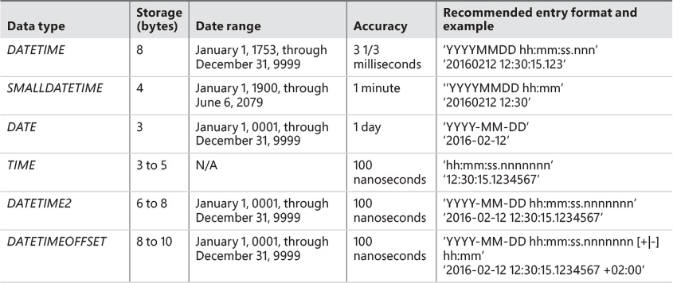

# T-SQL Fundamentals, Third Edition

by Itzik Ben-Gan

August 2016

---

# Chapter 1 summary

History - SEQUEL from IBM in 1970s, trademark/copyright issue so had to be SQL.

- Today it is common to see RDBMSs that support languages other than a dialect of SQL, such as the CLR integration in SQL Server (e.g. use C# to get at SQL data directly)

Most programming languages are imperative, but SQL is declarative - tell it what you want, not how to do it.


---

# Types of SQL statements

SQL has several categories of statements, including Data Definition Language (DDL), Data Manipulation Language (DML), and Data Control Language (DCL). DDL deals with object definitions and includes statements such as CREATE, ALTER, and DROP. DML allows you to query and modify data and includes statements such as SELECT, INSERT, UPDATE, DELETE, TRUNCATE, and MERGE. It’s a common misunderstanding that DML includes only data-modification statements, but as I mentioned, it also includes SELECT. Another common misunderstanding is that TRUNCATE is a DDL statement, but in fact it is a DML statement. DCL deals with permissions and includes statements such as GRANT and REVOKE. This book focuses on DML.

---

# T-SQL

T-SQL is based on standard SQL, but it also provides some nonstandard/proprietary extensions. Moreover, T-SQL does not implement all of standard SQL. In other words, T-SQL is both a subset and a superset of SQL.

---

# Set theory and predicates

By a “set” we mean any collection M into a whole of definite, distinct objects m (which are called the “elements” of M) of our perception or of our thought.

—Joseph W. Dauben and Georg Cantor (Princeton University Press, 1990)


Loosely speaking, a predicate is a property or an expression that either holds or doesn’t hold—in other words, is either true or false.

# Relational model

The first version of the relational model was proposed by Codd in 1969 in an IBM research report called “Derivability, Redundancy, and Consistency of Relations Stored in Large Data Banks.” A revised version was proposed by Codd in 1970 in a paper called “A Relational Model of Data for Large Shared Data Banks,” published in the journal Communications of the ACM.


The goal of the relational model is to enable consistent representation of data with minimal or no redundancy and without sacrificing completeness, and to define data integrity (enforcement of data consistency) as part of the model.

“Relational” actually pertains to the mathematical term relation. In set theory, a relation is a representation of a set. In the relational model, a relation is a set of related information, with the counterpart in SQL being a table—albeit not an exact counterpart. A key point in the relational model is that a single relation should represent a single set (for example, Customers).

---

# Missing NULL values

One aspect of the relational model is the source of many passionate debates—whether predicates should be restricted to two-valued logic. That is, in two-valued predicate logic, a predicate is either true or false. If a predicate is not true, it must be false. Use of two-valued predicate logic follows a mathematical law called “the law of excluded middle.” However, some say that there’s room for three-valued (or even four-valued) predicate logic, taking into account cases where values are missing. A predicate involving a missing value yields neither true nor false—it yields unknown.

Some people believe that three-valued predicate logic is nonrelational, whereas others believe that it is relational. Codd actually advocated for four-valued predicate logic, saying that there were two different cases of missing values: missing but applicable (A-Values marker), and missing but inapplicable (I-Values marker). An example of “missing but applicable” is when an employee has a mobile phone, but you don’t know what the mobile phone number is. An example of “missing but inapplicable” is when an employee doesn’t have a mobile phone at all.

NULL is not a value but rather a marker for a missing value. Therefore, though unfortunately it’s common, the use of the terminology “NULL value” is incorrect. The correct terminology is “NULL marker” or just “NULL.”

---

# Constraints

Data integrity is achieved through rules called constraints that are defined in the data model and enforced by the RDBMS. The simplest methods of enforcing integrity are assigning an attribute type with its attendant “nullability” (whether it supports or doesn’t support NULLs).

Other examples of constraints include candidate keys, which provide entity integrity, and foreign keys, which provide referential integrity. A candidate key is a key defined on one or more attributes that prevents more than one occurrence of the same tuple (row in SQL) in a relation. A predicate based on a candidate key can uniquely identify a row (such as an employee).

---

# Normalization

1NF
The first normal form says that the tuples (rows) in the relation (table) must be unique and attributes should be atomic. This is a redundant definition of a relation; in other words, if a table truly represents a relation, it is already in first normal form.

You achieve unique rows in SQL by defining a unique key for the table.

Atomicity of attributes is subjective in the same way that the definition of a set is subjective. As an example, should an employee name in an Employees relation be expressed with one attribute (fullname), two (firstname and lastname), or three (firstname, middlename, and lastname)? The answer depends on the application. If the application needs to manipulate the parts of the employee’s name separately (such as for search purposes), it makes sense to break them apart; otherwise, it doesn’t.

2NF

The second normal form involves two rules. One rule is that the data must meet the first normal form. The other rule addresses the relationship between nonkey and candidate-key attributes. For every candidate key, every nonkey attribute has to be fully functionally dependent on the entire candidate key. 


3NF

The third normal form also has two rules. The data must meet the second normal form. Also, all nonkey attributes must be dependent on candidate keys nontransitively. Informally, this rule means that all nonkey attributes must be mutually independent. In other words, one nonkey attribute cannot be dependent on another nonkey attribute.


Informally, 2NF and 3NF are commonly summarized with the sentence, “Every non-key attribute is dependent on the key, the whole key, and nothing but the key—so help me Codd.”


There are higher normal forms beyond Codd’s original first three normal forms that involve compound primary keys and temporal databases


---

# OLTP, DW, DM

online transactional processing (OLTP) and data warehouses (DWs)

DSA: data-staging area

ETL: extract, transform, and load

OLTP for read/write/update
DW or Data Mart for analysis (DW general, DM for specific team)
DSA for moving data from OLTP to DW (ETL)


DW/DM can use star/snowflake schema, which has some duplication of data

---

# Box, Appliance, Cloud

Box - on prem, fully custom

Appliance - on prem, premade/ready to go

Cloud - offsite, managed

Can have multiple instances on one server, e.g. support instance for recreating bugs

---

# SQL DBs

Some DBs created by default with SQL server:

The system databases that the setup program creates include master, Resource, model, tempdb, and msdb. A description of each follows:

Image master The master database holds instance-wide metadata information, the server configuration, information about all databases in the instance, and initialization information.

Image Resource The Resource database is a hidden, read-only database that holds the definitions of all system objects. When you query system objects in a database, they appear to reside in the sys schema of the local database, but in actuality their definitions reside in the Resource database.

Image model The model database is used as a template for new databases. Every new database you create is initially created as a copy of model. So if you want certain objects (such as data types) to appear in all new databases you create, or certain database properties to be configured in a certain way in all new databases, you need to create those objects and configure those properties in the model database. Note that changes you apply to the model database will not affect existing databases—only new databases you create in the future.

Image tempdb The tempdb database is where SQL Server stores temporary data such as work tables, sort and hash table data, row versioning information, and so on. With SQL Server, you can create temporary tables for your own use, and the physical location of those temporary tables is tempdb. Note that this database is destroyed and re-created as a copy of the model database every time you restart the instance of SQL Server.

Image msdb The msdb database is used mainly by a service called SQL Server Agent to store its data. SQL Server Agent is in charge of automation, which includes entities such as jobs, schedules, and alerts. SQL Server Agent is also the service in charge of replication. The msdb database also holds information related to other SQL Server features, such as Database Mail, Service Broker, backups, and more.

---

# Schemas/objects

You can control permissions at the schema level. For example, you can grant a user SELECT permissions on a schema, allowing the user to query data from all objects in that schema. 
You can think of a schema as a container of objects, such as tables, views, stored procedures, and others.

The schema is also a namespace—it is used as a prefix to the object name. For example, suppose you have a table named Orders in a schema named Sales. The schema-qualified object name (also known as the two-part object name) is Sales.Orders. You can refer to objects in other databases by adding the database name as a prefix (three-part object name), and to objects in other instances by adding the instance name as a prefix (four-part object name). If you omit the schema name when referring to an object, SQL Server will apply a process to resolve the schema name, such as checking whether the object exists in the user’s default schema and, if the object doesn’t exist, checking whether it exists in the dbo schema. Microsoft recommends that when you refer to objects in your code you always use the two-part object names.

---

# Coding style

Anything consistent and clean works. Best to use semicolon at the end of statements as MS may be bringing it back.


# Constraints

Can add constraints such as primary key to make rows unique, or unique values

```
ALTER TABLE dbo.Employees
  ADD CONSTRAINT UNQ_Employees_ssn
  UNIQUE(ssn);
```

If doing this with NULLs, need to filter them out when making constraint:

`CREATE UNIQUE INDEX idx_ssn_notnull ON dbo.Employees(ssn) WHERE ssn IS NOT NULL;`

Check constraints can constrain values:

```
ALTER TABLE dbo.Employees
  ADD CONSTRAINT CHK_Employees_salary
  CHECK(salary > 0.00);
```

default values:

```
ALTER TABLE dbo.Orders
  ADD CONSTRAINT DFT_Orders_orderts
  DEFAULT(SYSDATETIME()) FOR orderts;
```

---

# Ch2 - single-table queries

Select:

```
USE TSQLV4;

SELECT empid, YEAR(orderdate) AS orderyear, COUNT(*) AS numorders
FROM Sales.Orders
WHERE custid = 71
GROUP BY empid, YEAR(orderdate)
HAVING COUNT(*) > 1
ORDER BY empid, orderyear;
```

"logical" order would be:

```
FROM Sales.Orders
WHERE custid = 71
GROUP BY empid, YEAR(orderdate)
HAVING COUNT(*) > 1
SELECT empid, YEAR  (orderdate) AS orderyear, COUNT(*) AS numorders
ORDER BY empid, orderyear
```

But declarative SQL is more like english than machine language.

onsider an instruction made by one human to another in English, such as, “Bring me the car keys from the top-left drawer in the kitchen.” Notice that you start the instruction with the object and then indicate the location where the object resides. But if you were to express the same instruction to a robot, or a computer program, you would have to start with the location before indicating what can be obtained from that location. Your instruction might have been something like, “Go to the kitchen; open the top-left drawer; grab the car keys; bring them to me.”

---

# phrase/clause

A query clause is a syntactical component of a query, so when discussing the syntax of a query element I usually use the term clause—for example, “In the WHERE clause, you specify a predicate.” When discussing the logical manipulation taking place as part of logical query processing, I usually use the term phase—for example, “The WHERE phase returns rows for which the predicate evaluates to TRUE.”

---

# delimiters

If an identifier is irregular—for example, if it has embedded spaces or special characters, starts with a digit, or is a reserved keyword—you have to delimit it. You can delimit identifiers in SQL Server in a couple of ways. The standard SQL form is to use double quotes—for example, “Order Details”. The form specific to T-SQL is to use square brackets—for example, [Order Details]—but T-SQL also supports the standard form.

With identifiers that do comply with the rules for the format of regular identifiers, delimiting is optional.

 --- 
 # T-SQL 3-valued predicate logic

 only rows for which the logical expression evaluates to TRUE are returned by the WHERE phase. Always keep in mind that T-SQL uses three-valued predicate logic, where logical expressions can evaluate to TRUE, FALSE, or UNKNOWN. With three-valued logic, saying “returns TRUE” is not the same as saying “does not return FALSE.”

---

# Groupby

If the query involves grouping, all phases subsequent to the GROUP BY phase—including HAVING, SELECT, and ORDER BY—must operate on groups as opposed to operating on individual rows.

Elements that do not participate in the GROUP BY clause are allowed only as inputs to an aggregate function such as COUNT, SUM, AVG, MIN, or MAX. 

Note that all aggregate functions ignore NULLs, with one exception—COUNT(*).

Can get count distinct with COUNT(DISTINCT qty) or with other agg funcs.

---

# having

Whereas the WHERE clause is a row filter, the HAVING clause is a group filter.

Only groups for which the HAVING predicate evaluates to TRUE are returned by the HAVING phase to the next logical query processing phase. Groups for which the predicate evaluates to FALSE or UNKNOWN are discarded.

---

# aliases

Expressions that do apply manipulation, such as YEAR(orderdate), or that are not based on a source attribute, such as a call to the function SYSDATETIME, won’t have a name unless you alias them.

In addition to supporting the form <expression> AS <alias>, T-SQL also supports the forms <alias> = <expression> (“alias equals expression”) and <expression> <alias> (“expression space alias”).

Note that if by mistake you miss a comma between two column names in the SELECT list, your code won’t fail. Instead, SQL Server will assume the second name is an alias for the first column name.

---

# select

Remember that the SELECT clause is processed after the FROM, WHERE, GROUP BY, and HAVING clauses. This means that aliases assigned to expressions in the SELECT clause do not exist as far as clauses that are processed before the SELECT clause are concerned.

Amusingly, a lecture attendee once asked me in all seriousness when Microsoft is going to fix this bug [invalid column name when trying to use aliases in WHERE or other clauses after SELECT]. As you can gather from this chapter, this behavior is not a bug; rather, it is by design. Also, it was not defined by Microsoft; rather, it was defined by the SQL standard.

Unlike the relational model, which is based on mathematical set theory, SQL is based on multiset theory. The mathematical term multiset, or bag, is similar in some aspects to a set but does allow duplicates.

SQL provides the means to remove duplicates using the DISTINCT clause

Don't use * - use of an asterisk is considered a bad programming practice in most cases. It is recommended that you explicitly list all attributes you need. Unlike with the relational model, SQL keeps ordinal positions for columns based on the order in which you specified them in the CREATE TABLE statement. By specifying SELECT *, you’re guaranteed to get the columns ordered in the output based on their ordinal positions.

Any schema changes applied to the table—such as adding or removing columns, rearranging their order, and so on—might result in failures in the client application or, even worse, in application bugs that will go unnoticed.

Curiously, you are not allowed to refer to column aliases created in the SELECT clause in other expressions within the same SELECT clause.

---

# order

a table—be it an existing table in the database or a table result returned by a query—has no guaranteed order. 

if you do specify an ORDER BY clause, the result can’t qualify as a table because it is ordered. Standard SQL calls such a result a cursor.

Some language elements and operations in SQL expect to work with table results of queries and not with cursors. Examples include table expressions and set operators

The ORDER BY phase is the only phase in which you can refer to column aliases created in the SELECT phase, because it is the only phase processed after the SELECT phase.

Note that if you define a column alias that is the same as an underlying column name, as in 1 - col1 AS col1, and refer to that alias in the ORDER BY clause, the new column is the one considered for ordering.

With T-SQL, you also can specify elements in the ORDER BY clause that do not appear in the SELECT clause, meaning you can sort by something you don’t necessarily want to return.


---

# TOP clause

The TOP filter is a proprietary T-SQL feature you can use to limit the number or percentage of rows your query returns. It relies on two elements as part of its specification: one is the number or percent of rows to return, and the other is the ordering. For example, to return from the Orders table the five most recent orders, you specify TOP (5) in the SELECT clause and orderdate DESC in the ORDER BY clause

You can use the TOP option with the PERCENT keyword, in which case SQL Server calculates the number of rows to return based on a percentage of the number of qualifying rows, rounded up.

e.g. 

```
SELECT TOP (1) PERCENT orderid, orderdate, custid, empid
FROM Sales.Orders
ORDER BY orderdate DESC;
```

If you want the query to be deterministic, you need to make the ORDER BY list unique; in other words, add a tiebreaker.

Can also return with ties:

```
SELECT TOP (5) WITH TIES orderid, orderdate, custid, empid
FROM Sales.Orders
ORDER BY orderdate DESC;
```

---

# OFFSET-FETCH

The TOP filter is very practical, but it has two shortcomings—it’s not standard, and it doesn’t support a skipping capability. T-SQL also supports a standard, TOP-like filter, called OFFSET-FETCH, which does support a skipping option. This makes it very useful for ad-hoc paging purposes.

The OFFSET-FETCH filter is considered an extension to the ORDER BY clause.

With the OFFSET clause you indicate how many rows to skip, and with the FETCH clause you indicate how many rows to filter after the skipped rows. 

e.g.

```
SELECT orderid, orderdate, custid, empid
FROM Sales.Orders
ORDER BY orderdate, orderid
OFFSET 50 ROWS FETCH NEXT 25 ROWS ONLY;
```

Note that a query that uses OFFSET-FETCH must have an ORDER BY clause.

FETCH must come with OFFSET. However, OFFSET without FETCH is allowed.

The singular and plural forms ROW and ROWS are interchangeable.

Also, if you’re not skipping any rows (OFFSET 0 ROWS), you might find the term “first” more suitable than “next.” Hence, the forms FIRST and NEXT are interchangeable. - does this mean you can use FETCH FIRST or FETCH NEXT?

As of 2016 the T-SQL implementation of the OFFSET-FETCH filter doesn’t yet support the PERCENT and WITH TIES options that TOP does.

---

# Window functions
A window function is a function that, for each row in the underlying query, operates on a window (set) of rows that is derived from the underlying query result, and computes a scalar (single) result value. 

The window of rows is defined with an OVER clause. 

Window functions are a SQL standard, but T-SQL supports a subset of the features from the standard.

Note that the ROW_NUMBER function must produce unique values within each partition. This means that even when the ordering value doesn’t increase, the row number still must increase. Therefore, if the ROW_NUMBER function’s ORDER BY list is non-unique, the query is nondeterministic.

---

# Order of operations

- FROM
- WHERE
- GROUP BY
- HAVING
- SELECT
- Expressions
- DISTINCT
- ORDER BY
- TOP/OFFSET-FETCH

---

# predicates and operators

T-SQL has language elements in which predicates can be specified—for example, query filters such as WHERE and HAVING, CHECK constraints, and others. Remember that predicates are logical expressions that evaluate to TRUE, FALSE, or UNKNOWN. You can combine predicates by using logical operators such as AND (forming a combination known as a conjunction of predicates) and OR (known as a disjunction of predicates).

IN, BETWEEN, and LIKE.

e.g. `WHERE lastname LIKE N'D%';`

Notice the use of the letter N to prefix the string ‘D%’; it stands for National and is used to denote that a character string is of a Unicode data type (NCHAR or NVARCHAR), as opposed to a regular character data type (CHAR or VARCHAR). Because the data type of the lastname attribute is NVARCHAR(40), the letter N is used to prefix the string.

T-SQL supports the following comparison operators: =, >, <, >=, <=, <>, !=, !>, !<, of which the last three are not standard.

Because the nonstandard operators have standard alternatives (such as <> instead of !=), I recommend you avoid using nonstandard operators.

If you need to combine logical expressions, you can use the logical operators OR and AND. If you want to negate an expression, you can use the NOT operator.

Note that the data type of a scalar expression involving two operands is determined in T-SQL by the higher of the two in terms of data-type precedence. If both operands are of the same data type, the result of the expression is of the same data type as well. For example, a division between two integers (INT) yields an integer. The expression 5/2 returns the integer 2 and not the numeric 2.5. This is not a problem when you are dealing with constants, because you can always specify the values as numeric ones with a decimal point. But when you are dealing with, say, two integer columns, as in col1/col2, you need to cast the operands to the appropriate type if you want the calculation to be a numeric one: CAST(col1 AS NUMERIC(12, 2))/CAST(col2 AS NUMERIC(12, 2)). The data type NUMERIC(12, 2)

If the two operands are of different types, the one with the lower precedence is promoted to the one that is higher. For example, in the expression 5/2.0, the first operand is INT and the second is NUMERIC. Because NUMERIC is considered higher than INT, the INT operand 5 is implicitly converted to the NUMERIC 5.0 before the arithmetic operation, and you get the result 2.5.

You can find the precedence order among types in 
SQL Server Books Online under “Data Type Precedence.”

https://learn.microsoft.com/en-us/sql/t-sql/data-types/data-type-precedence-transact-sql?view=sql-server-ver16


The following list describes the precedence among operators, from highest to lowest:

1. ( ) (Parentheses)
2. * (Multiplication), / (Division), % (Modulo)
3. + (Positive), – (Negative), + (Addition), + (Concatenation), – (Subtraction)
4. =, >, <, >=, <=, <>, !=, !>, !< (Comparison operators)
5. NOT
6. AND
7. BETWEEN, IN, LIKE, OR
8. = (Assignment)


Parentheses have the highest precedence, so they give you full control. For the sake of other people who need to review or maintain your code and for readability purposes, it’s a good practice to use parentheses even when they are not required. The same is true with indentation


---

# CASE

Because CASE is a scalar expression, it is allowed wherever scalar expressions are allowed, such as in the SELECT, WHERE, HAVING, and ORDER BY clauses and in CHECK constraints.

A CASE expression is a scalar expression that returns a value based on conditional logic.

There are two forms of CASE expressions: simple and searched. You use the simple form to compare one value or scalar expression with a list of possible values and return a value for the first match. If no value in the list is equal to the tested value, the CASE expression returns the value that appears in the ELSE clause (if one exists). If the CASE expression doesn’t have an ELSE clause, it defaults to ELSE NULL.

The simple CASE form has a single test value or expression right after the CASE keyword that is compared with a list of possible values in the WHEN clauses. The searched CASE form is more flexible in the sense you can specify predicates in the WHEN clauses rather than being restricted to using equality comparisons.

simple = map
searched = conditions with ranges

e.g.

```
SELECT orderid, custid, val,
  CASE
    WHEN val < 1000.00                   THEN 'Less than 1000'
    WHEN val BETWEEN 1000.00 AND 3000.00 THEN 'Between 1000 and 3000'
    WHEN val > 3000.00                   THEN 'More than 3000'
    ELSE 'Unknown'
  END AS valuecategory
FROM Sales.OrderValues;
```
```
CASE
  WHEN 1
```

for simple.

---

# COALESCE and others
T-SQL supports some functions you can consider as abbreviations of the CASE expression: ISNULL, COALESCE, IIF, and CHOOSE. Note that of the four, only COALESCE is standard.

The ISNULL function accepts two arguments as input and returns the first that is not NULL, or NULL if both are NULL. For example ISNULL(col1, ‘’) returns the col1 value if it isn’t NULL and an empty string if it is NULL. The COALESCE function is similar, only it supports two or more arguments and returns the first that isn’t NULL, or NULL if all are NULL.

The nonstandard IIF and CHOOSE functions were added to T-SQL to support easier migrations from Microsoft Access. The function IIF(<logical_expression>, <expr1>, <expr2>) returns expr1 if logical_expression is TRUE, and it returns expr2 otherwise. For example, the expression IIF(col1 <> 0, col2/col1, NULL) returns the result of col2/col1 if col1 is not zero; otherwise, it returns a NULL. The function CHOOSE(<index>, <expr1>, <expr2>, ..., <exprn>) returns the expression from the list in the specified index. For example, the expression CHOOSE(3, col1, col2, col3) returns the value of col3. Of course, actual expressions that use the CHOOSE function tend to be more dynamic—for example, relying on user input.

---

# NULLS
uses three-valued predicate logic, meaning that predicates can evaluate to TRUE, FALSE, or UNKNOWN (for nulls)

SQL has different treatments for UNKNOWN in different language elements

The treatment SQL has for query filters is “accept TRUE,” meaning that both FALSE and UNKNOWN are discarded. Conversely, the definition of the treatment SQL has for CHECK constraints is “reject FALSE,” meaning that both TRUE and UNKNOWN are accepted.

with three-valued predicate logic, “accept TRUE” rejects UNKNOWN, whereas “reject FALSE” accepts it

One of the tricky aspects of the logical value UNKNOWN is that when you negate it, you still get UNKNOWN.

an expression comparing two NULLs (NULL = NULL) evaluates to UNKNOWN.
SQL provides you with the predicates IS NULL and IS NOT NULL, which you should use instead of = NULL and <> NULL

For example, for grouping and sorting purposes, two NULLs are considered equal. That is, the GROUP BY clause arranges all NULLs in one group just like present values, and the ORDER BY clause sorts all NULLs together. Standard SQL leaves it to the product implementation to determine whether NULLs sort before present values or after them, but it must be consistent within the implementation. T-SQL sorts NULLs before present values.

For the purposes of enforcing a UNIQUE constraint, standard SQL treats NULLs as different from each other (allowing multiple NULLs). Conversely, in T-SQL, a UNIQUE constraint considers two NULLs as equal (allowing only one NULL).

---

# All-at-once operations

SQL supports a concept called all-at-once operations, which means that all expressions that appear in the same logical query processing phase are evaluated logically at the same point in time. 

e.g. this could fail if col1 has null or 0

```
SELECT col1, col2
FROM dbo.T1
WHERE col1 <> 0 AND col2/col1 > 2;
```

also can't refer to aliases in other parts of select

can do this to get around:

```
SELECT col1, col2
FROM dbo.T1
WHERE
  CASE
    WHEN col1 = 0 THEN 'no' -- or 'yes' if row should be returned
    WHEN col2/col1 > 2 THEN 'yes'
    ELSE 'no'
  END = 'yes';
```

SQL Server guarantees the processing order of the WHEN clauses in a CASE expression.

---

# character data

SQL Server supports two kinds of character data types: regular and Unicode. Regular data types include CHAR and VARCHAR, and Unicode data types include NCHAR and NVARCHAR. Regular characters use 1 byte of storage for each character, whereas Unicode data requires 2 bytes per character, and in cases in which a surrogate pair is needed, 4 bytes are required. (For details on surrogate pairs, see https://msdn.microsoft.com/en-us/library/windows/desktop/dd374069.)

If you choose a regular character type for a column, you are restricted to only one language in addition to English.

With Unicode data types, multiple languages are supported.

When expressing a regular character literal, you simply use single quotes: ‘This is a regular character string literal’. When expressing a Unicode character literal, you need to specify the character N (for National) as a prefix: N’This is a Unicode character string literal’.

Any data type without the VAR element (CHAR, NCHAR) in its name has a fixed length, which means that SQL Server preserves space in the row based on the column’s defined size and not on the actual number of characters in the character string. For example, when a column is defined as CHAR(25), SQL Server preserves space for 25 characters in the row regardless of the length of the stored character string.

---

# collation

Collation is a property of character data that encapsulates several aspects: language support, sort order, case sensitivity, accent sensitivity, and more. To get the set of supported collations and their descriptions, you can query the table function fn_helpcollations as follows:

```
SELECT name, description
FROM sys.fn_helpcollations();
```

Dictionary sorting Sorting and comparison of character data are based on dictionary order (A and a < B and b).

If the element BIN appeared, it would mean that the sorting and comparison of character data was based on the binary representation of characters (A < B < a < b).

When you create a user database, you can specify a collation for the database by using the COLLATE clause. If you don’t, the instance’s collation is assumed by default.

The database collation determines the collation of the metadata of objects in the database and is used as the default for user table columns. 
-  including object and column names

For example, if the database collation is case insensitive, you can’t create two tables called T1 and t1 within the same schema, but if the database collation is case sensitive, you can do that. 

If you want to make the filter case sensitive even though the column’s collation is case insensitive, you can convert the collation of the expression:

```
SELECT empid, firstname, lastname
FROM HR.Employees
WHERE lastname COLLATE Latin1_General_CS_AS = N'davis';
```

---

# quotes

In standard SQL, single quotes are used to delimit literal character strings (for example, ‘literal’) and double quotes are used to delimit irregular identifiers such as table or column names that include a space or start with a digit (for example, “Irregular Identifier”)

In SQL Server, there’s a setting called QUOTED_IDENTIFIER that controls the meaning of double quotes. You can apply this setting either at the database level by using the ALTER DATABASE command or at the session level by using the SET command. When the setting is turned on, the behavior is determined according to standard SQL, meaning that double quotes are used to delimit identifiers. When the setting is turned off, the behavior is nonstandard, and double quotes are used to delimit literal character strings.

It is strongly recommended that you follow best practices and use standard behavior (with the setting on). Most database interfaces, including OLE DB and ODBC, turn this setting on by default.

As an alternative to using double quotes to delimit identifiers, T-SQL also supports square brackets (for example, [Irregular Identifier]).

to express the literal abc’de, specify ‘abc’‘de’.

---

# operators and functions

For string concatenation, T-SQL provides the plus-sign (+) operator and the CONCAT function. For other operations on character strings, T-SQL provides several functions, including SUBSTRING, LEFT, RIGHT, LEN, DATALENGTH, CHARINDEX, PATINDEX, REPLACE, REPLICATE, STUFF, UPPER, LOWER, RTRIM, LTRIM, FORMAT, COMPRESS, DECOMPRESS, and STRING_SPLIT

Standard SQL dictates that a concatenation with a NULL should yield a NULL. This is the default behavior of T-SQL.

To treat a NULL as an empty string—or more accurately, to substitute a NULL with an empty string—you can use the COALESCE function. This function accepts a list of input values and returns the first that is not NULL.

T-SQL supports a function called CONCAT that accepts a list of inputs for concatenation and automatically substitutes NULLs with empty strings. For example, the expression CONCAT(‘a’, NULL, ‘b’) returns the string ‘ab’.

SUBSTRING(string, start, length)

This function operates on the input string and extracts a substring starting at position start that is length characters long.
If the value of the third argument exceeds the end of the input string, the function returns everything until the end without raising an error. 

The LEFT and RIGHT functions are abbreviations of the SUBSTRING function, returning a requested number of characters from the left or right end of the input string.
`LEFT(string, n), RIGHT(string, n)`

The LEN function returns the number of characters in the input string.

`LEN(string)`

With regular characters, both numbers are the same because each character requires 1 byte of storage. With Unicode characters, each character requires at least 2 bytes of storage (in most cases, at least); therefore, the number of characters is half the number of bytes. To get the number of bytes, use the DATALENGTH function instead of LEN.

e.g. `SELECT LEN(N'abcde');` returns 5, `SELECT DATALENGTH(N'abcde');` returns 10

Another difference between LEN and DATALENGTH is that the former excludes trailing blanks but the latter doesn’t.

The CHARINDEX function returns the position of the first occurrence of a substring within a string.

`CHARINDEX(substring, string[, start_pos])`

This function returns the position of the first argument, substring, within the second argument, string. You can optionally specify a third argument, start_pos, to tell the function the position from which to start looking. If you don’t specify the third argument, the function starts looking from the first character. If the substring is not found, the function returns 0. 

The PATINDEX function returns the position of the first occurrence of a pattern within a string.

`PATINDEX(pattern, string)`

The REPLACE function replaces all occurrences of a substring with another.

`REPLACE(string, substring1, substring2)`

You can use the REPLACE function to count the number of occurrences of a character within a string. To do this, you replace all occurrences of the character with an empty string (zero characters) and calculate the original length of the string minus the new length.

The REPLICATE function replicates a string a requested number of times.

`REPLICATE(string, n)`

Note that T-SQL supports a function called FORMAT that you can use to achieve such formatting needs much more easily, though at a higher cost.

You use the STUFF function to remove a substring from a string and insert a new substring instead.

`STUFF(string, pos, delete_length, insert_string)`

If you just want to insert a string and not delete anything, you can specify a length of 0 as the third argument.

The UPPER and LOWER functions return the input string with all uppercase or lowercase characters, respectively.

`UPPER(string), LOWER(string)`

The RTRIM and LTRIM functions return the input string with leading or trailing spaces removed.

`RTRIM(string), LTRIM(string)`

You use the FORMAT function to format an input value as a character string based on a Microsoft .NET format string and an optional culture specification.

`FORMAT(input , format_string, culture)`

The FORMAT function is usually more expensive than alternative T-SQL functions that you use to format values. You should generally refrain from using it unless you are willing to accept the performance penalty. As an example, I ran a query against a table with 1,000,000 rows to compute the 10-digit string representation of one of the integer columns. The query took close to a minute to complete on my computer with the FORMAT function compared to under a second with the alternative method using the REPLICATE and RIGHT functions.

The COMPRESS and DECOMPRESS functions use the GZIP algorithm to compress and decompress the input, respectively. Both functions were introduced in SQL Server 2016.

`COMPRESS(string), DECOMPRESS(string)`

To get the original value, you need to cast the result to the target character string type, like so:

```
SELECT
  CAST(
    DECOMPRESS(COMPRESS(N'This is my cv. Imagine it was much longer.'))
      AS NVARCHAR(MAX));
```

The STRING_SPLIT table function splits an input string with a separated list of values into the individual elements. This function was introduced in SQL Server 2016.

`SELECT value FROM STRING_SPLIT(string, separator);`

Unlike the string functions described so far, which are all scalar functions, the STRING_SPLIT function is a table function. It accepts as inputs a string with a separated list of values plus a separator, and it returns a table result with a string column called val with the individual elements. If you need the elements to be returned with a data type other than a character string, you will need to cast the val column to the target type.

T-SQL provides a predicate called LIKE that you can use to check whether a character string matches a specified pattern. Similar patterns are used by the PATINDEX function described earlier. 

The percent sign represents a string of any size, including an empty string.

Note that often you can use functions such as SUBSTRING and LEFT instead of the LIKE predicate to represent the same meaning. But the LIKE predicate tends to get optimized better—especially when the pattern starts with a known prefix.

An underscore represents a single character. For example, the following query returns employees where the second character in the last name is e:

```
SELECT empid, lastname
FROM HR.Employees
WHERE lastname LIKE N'_e%';
```

Square brackets with a list of characters (such as [ABC]) represent a single character that must be one of the characters specified in the list.

Square brackets with a character range (such as [A-E]) represent a single character that must be within the specified range. e.g. A-E

Square brackets with a caret sign (^) followed by a character list or range (such as [^A-E]) represent a single character that is not in the specified character list or range.

If you want to search for a character that is also used as a wildcard (such as %, _, [, or ]), you can use an escape character. 

specify the keyword ESCAPE followed by the escape character right after the pattern. For example, to check whether a column called col1 contains an underscore, use col1 LIKE ‘%!_%’ ESCAPE ‘!’.

For the wildcards %, _, and [, you can use square brackets instead of an escape character. For example, instead of col1 LIKE ‘%!_%’ ESCAPE ‘!’, you can use col1 LIKE ‘%[_]%’.

---

# Datetime stuff

T-SQL supports six date and time data types: two legacy types called DATETIME and SMALLDATETIME, and four later additions (since SQL Server 2008) called DATE, TIME, DATETIME2, and DATETIMEOFFSET. The legacy types DATETIME and SMALLDATETIME include date and time components that are inseparable. The two types differ in their storage requirements, their supported date range, and their precision. The DATE and TIME data types provide a separation between the date and time components if you need it. The DATETIME2 data type has a bigger date range and better precision than the legacy types. The DATETIMEOFFSET data type is similar to DATETIME2, but it also includes the offset from UTC.



The storage requirements for the last three data types above (TIME, DATETIME2, and DATETIMEOFFSET) depend on the precision you choose. You specify a fractional-second precision as an integer in the range 0 to 7. For example, TIME(0) means 0 fractional-second precision—in other words, one-second precision. TIME(3) means one-millisecond precision, and TIME(7) means 100-nanosecond precision. If you don’t specify a fractional-second precision, SQL Server assumes 7 by default. 

best practice to use character strings to express date and time values

implicit conversion between types is based on what’s called data-type precedence. SQL Server defines precedence among data types and will usually implicitly convert the operand that has a lower data-type precedence to the one that has higher precedence.

e.g. `WHERE orderdate = '20160212'` goes to the column’s data type (DATETIME) because character strings are considered lower in terms of data-type precedence with respect to date and time data types [note: this seems backwards to me if it should convert to lowest datatype, or he meant it will convert as needed to execute the filter]. Same as `WHERE orderdate = CAST('20160212' AS DATE)`

Note that some character-string formats of date and time literals are language dependent, meaning that when you convert them to a date and time data type, SQL Server might interpret the value differently based on the language setting in effect in the session.

Each login defined by the database administrator has a default language associated with it, and unless it is changed explicitly, that language becomes the effective language in the session. You can overwrite the default language in your session by using the SET LANGUAGE command, but this is generally not recommended because some aspects of the code might rely on the user’s default language.
- sets DATEFORMAT, which determines how SQL Server interprets the literals you enter when they are converted from a character-string type to a date and time type
- us_english language setting sets the DATEFORMAT to mdy, whereas the British language setting sets the DATEFORMAT to dmy. You can override the DATEFORMAT setting in your session by using the SET DATEFORMAT command, but as mentioned earlier, changing language-related settings is generally not recommended.
- Output format is determined by the database interface used by the client tool (such as ODBC)
- OLE DB (Object Linking and Embedding, Database), Open Database Connectivity (ODBC, a C language interface) use ‘YYYY-MM-DD’

phrase your literals in a language-neutral manner:


With all types that include both date and time components, if you don’t specify a time part in your literal, SQL Server assumes midnight. If you don’t specify an offset from UTC, SQL Server assumes 00:00.

using language-neutral formats such as ‘YYYYMMDD’ is a best practice

SQL Server Books Online has a table with all the style numbers and the formats they represent. You can find it under the topic “The CAST and CONVERT Functions.” For example, if you want to specify the literal ‘02/12/2016’ with the format MM/DD/YYYY, use style number 101: `SELECT CONVERT(DATE, '02/12/2016', 101);`

If you want to use the format DD/MM/YYYY, use style number 103

can use `PARSE`, same as style 101: `SELECT PARSE('02/12/2016' AS DATE USING 'en-US');` or 103: `SELECT PARSE('02/12/2016' AS DATE USING 'en-GB');`

The PARSE function is significantly more expensive than the CONVERT function

if using legacy DATETIME or SMALLDATETIME, store the date with a value of midnight in the time part
When you want to work only with times, you store the time with the base date January 1, 1900

When you need to filter only orders from a certain date, you don’t have to use a range filter, but can do `WHERE orderdate = '20160212'`

When SQL Server converts a character-string literal that has only a date to DATETIME, it assumes midnight by default

can use a CHECK constraint to ensure that only midnight is used as the time part:

```
ALTER TABLE Sales.Orders2
  ADD CONSTRAINT CHK_Orders2_orderdate
  CHECK( CONVERT(CHAR(12), orderdate, 114) = '00:00:00:000' );
```

If the time component is stored with nonmidnight values, you can use a range filter like this:

```
WHERE orderdate >= '20160212'
  AND orderdate < '20160213';
```

in most cases, when you apply manipulation on the filtered column, SQL Server cannot use an index in an efficient manner: instead of `WHERE YEAR(orderdate) = 2015`, do `WHERE orderdate >= '20150101' AND orderdate < '20160101';`

---

# other datetime functions

GETDATE, CURRENT_TIMESTAMP, GETUTCDATE, SYSDATETIME, SYSUTCDATETIME, SYSDATETIMEOFFSET, CAST, CONVERT, SWITCHOFFSET, AT TIME ZONE, TODATETIMEOFFSET, DATEADD, DATEDIFF and DATEDIFF_BIG, DATEPART, YEAR, MONTH, DAY, DATENAME, various FROMPARTS functions, and EOMONTH


use standard option (e.g. `CURRENT_TIMESTAMP` and not `GETDATE`) when available

to get only date or time:

```
SELECT
  CAST(SYSDATETIME() AS DATE) AS [current_date],
  CAST(SYSDATETIME() AS TIME) AS [current_time];
```

can return NULL if can't be converted with `TRY_CAST`, `TRY_CONVERT`, and `TRY_PARSE`

```
CAST(value AS datatype)

TRY_CAST(value AS datatype)

CONVERT (datatype, value [, style_number])

TRY_CONVERT (datatype, value [, style_number])

PARSE (value AS datatype [USING culture])

TRY_PARSE (value AS datatype [USING culture])
```

In some cases, CONVERT has a third argument with which you can specify the style of the conversion (e.g. 101 or 103)

Note that CAST is standard and CONVERT and PARSE aren’t, so unless you need to use the style number or culture, it is recommended that you use the CAST function.

As a reminder, the PARSE function is significantly more expensive than the CONVERT function

SWITCHOFFSET(datetimeoffset_value, UTC_offset) - changes DATETIMEOFFSET value to a specified target offset from UTC

`SELECT SWITCHOFFSET(SYSDATETIMEOFFSET(), '-05:00');`

So if the current system datetimeoffset value is February 12, 2016 10:00:00.0000000 –08:00, this code returns the value February 12, 2016 13:00:00.0000000 –05:00.

`TODATETIMEOFFSET(local_date_and_time_value, UTC_offset)` constructs a DATETIMEOFFSET typed value from a local date and time value and an offset from UTC.
This function is different from SWITCHOFFSET in that its first input is a local date and time value without an offset component. You will typically use this function when migrating non-offset-aware data to offset-aware data.

`dt_val AT TIME ZONE time_zone` - accepts an input date and time value and converts it to a datetimeoffset value that corresponds to the specified target time zone, from 2016 onward

time_zone can be any of the supported Windows time-zone names as they appear in the name column in the sys.time_zone_info - depends on whether DST applies, e.g. 

```
SELECT
  CAST('20160212 12:00:00.0000000' AS DATETIME2)
    AT TIME ZONE 'Pacific Standard Time' AS val1
```

There are two tricky cases: when switching to DST and when switching from DST. For example, in Pacific Standard Time, when switching to DST the clock is advanced by an hour, so there’s an hour that doesn’t exist. If you specify a nonexisting time during that hour, the offset before the change (–08:00) is assumed. When switching from DST, the clock retreats by an hour, so there’s an hour that repeats itself. If you specify a time during that hour, starting at the bottom of the hour, non-DST is assumed (that is, the offset –08:00 is used).

When the input dt_val is a datetimeoffset value, the AT TIME ZONE function behaves more similarly to the SWITCHOFFSET function. Again, however, the target offset isn’t necessarily fixed.

`DATEADD(part, n, dt_val)` -  add a specified number of units of a specified date part to an input date and time value.

Valid values for the part input include year, quarter, month, dayofyear, day, week, weekday, hour, minute, second, millisecond, microsecond, and nanosecond.
`SELECT DATEADD(year, 1, '20160212');`

`DATEDIFF(part, dt_val1, dt_val2), DATEDIFF_BIG(part, dt_val1, dt_val2)` - DATEDIFF and DATEDIFF_BIG functions return the difference between two date and time values in terms of a specified date part. The former returns a value typed as INT (a 4-byte integer), and the latter returns a value typed as BIGINT (an 8-byte integer)
`SELECT DATEDIFF(day, '20150212', '20160212');`
If you want the last day of the month or year, simply use an anchor that is the last day of a month or year.
```
SELECT
  DATEADD(
    year,
    DATEDIFF(year, '18991231', SYSDATETIME()), '18991231');
```

To get end of month, use EOMONTH instead. Unfortunately, there are no similar functions to get the end of quarter and year, so you will need to use a computation for those such as the one just shown.

first day of month:

```
SELECT
  DATEADD(
    month,
    DATEDIFF(month, '19000101', SYSDATETIME()), '19000101');
```

`DATEPART(part, dt_val)` - returns an integer representing a requested part of a date and time value.
- part argument include year, quarter, month, dayofyear, day, week, weekday, hour, minute, second, millisecond, microsecond, nanosecond, TZoffset, and ISO_WEEK
month part: `SELECT DATEPART(month, '20160212');`

YEAR, MONTH, and DAY functions are abbreviations for the DATEPART function returning the integer representation of the year, month, and day parts of an input date and time value.
`YEAR(dt_val)`

`DATENAME(dt_val, part)` - character string representing a part of a date and time value.
`SELECT DATENAME(month, '20160212');`
DATENAME returns the name of the month, which is language dependent. If your session’s language is one of the English languages (such as U.S. English or British English), you get back the value ‘February’. If your session’s language is Italian, you get back the value ‘febbraio’

`ISDATE(string)` - character string as input and returns 1 if it is convertible to a date and time data type and 0 if it isn’t
`SELECT ISDATE('20160212');`


FROMPARTS functions:

```
DATEFROMPARTS (year, month, day)

DATETIME2FROMPARTS (year, month, day, hour, minute, seconds, fractions, precision)

DATETIMEFROMPARTS (year, month, day, hour, minute, seconds, milliseconds)

DATETIMEOFFSETFROMPARTS (year, month, day, hour, minute, seconds, fractions, hour_offset, minute_offset, precision)

SMALLDATETIMEFROMPARTS (year, month, day, hour, minute)

TIMEFROMPARTS (hour, minute, seconds, fractions, precision)
```
- integer inputs representing parts of a date and time value and construct a value of the requested type from those parts

`EOMONTH(input [, months_to_add])` - input date and time value and returns the respective end-of-month date as a DATE typed value
`SELECT EOMONTH(SYSDATETIME());`, filter by EOM - `WHERE orderdate = EOMONTH(orderdate)`

---

# querying metadata

in SQL Server Books Online in the “Querying the SQL Server System Catalog”

Catalog views provide detailed information about objects in the database, including information that is specific to SQL Server. For example, if you want to list the tables in a database along with their schema names

```
SELECT SCHEMA_NAME(schema_id) AS table_schema_name, name AS table_name
FROM sys.tables;
```

The SCHEMA_NAME function is used to convert the schema ID integer to its name.

To get information about columns in a table, you can query the sys.columns table.

```
SELECT
  name AS column_name,
  TYPE_NAME(system_type_id) AS column_type,
  max_length,
  collation_name,
  is_nullable
FROM sys.columns
WHERE object_id = OBJECT_ID(N'Sales.Orders');
```

can find the full list of objects and their detailed descriptions in SQL Server Books Online
sp_tables stored procedure returns a list of objects (such as tables and views) that can be queried in the current database: `EXEC sys.sp_tables;`

p_help procedure accepts an object name as input and returns multiple result sets with general information about the object, and also information about columns, indexes, constraints, and more:
```
EXEC sys.sp_help
  @objname = N'Sales.Orders';
```

or for columns:
```
EXEC sys.sp_columns
  @table_name = N'Orders',
  @table_owner = N'Sales';
```

constraints:
```
EXEC sys.sp_helpconstraint
  @objname = N'Sales.Orders';
```

---

# Joins

The FROM clause of a query is the first clause to be logically processed, and within the FROM clause, table operators operate on input tables. T-SQL supports four table operators: JOIN, APPLY, PIVOT, and UNPIVOT. The JOIN table operator is standard, whereas APPLY, PIVOT, and UNPIVOT are T-SQL extensions to the standard.

acts on table, applies logical query processing phases, and returns a table


cross joins, inner joins, and outer joins

cross join applies only one phase—Cartesian Product

inner join applies two phases—Cartesian Product and Filter

outer join - Cartesian Product, Filter, and Add Outer Rows

the query will be optimized by the physical implementation. It’s important to stress the term logical in logical query processing. The steps in the process apply operations to the input tables based on relational algebra. The database engine does not have to follow logical query processing phases literally, as long as it can guarantee that the result that it produces is the same as that dictated by logical query processing. The query optimizer often applies shortcuts when it knows it can still produce the correct result.

---

# Cross joins

T-SQL supports two standard syntaxes for cross joins: the ISO/ANSI SQL-92 and ISO/ANSI SQL-89 (recommend 92)

92:

```
SELECT C.custid, E.empid
FROM Sales.Customers AS C
  CROSS JOIN HR.Employees AS E;
```

Note that you are required to use column prefixes only when referring to ambiguous column names (column names that appear in more than one table); in unambiguous cases, column prefixes are optional.

89 (older):

```
SELECT C.custid, E.empid
FROM Sales.Customers AS C, HR.Employees AS E;
```

no logical or performance diff from 92

---

# self cross joins

```
SELECT
  E1.empid, E1.firstname, E1.lastname,
  E2.empid, E2.firstname, E2.lastname
FROM HR.Employees AS E1
  CROSS JOIN HR.Employees AS E2;
```

This gets all possible pairs of employees

One situation in which cross joins can be handy is when they are used to produce a result set with a sequence of integers (1, 2, 3, and so on). Such a sequence of numbers is an extremely powerful tool that I use for many purposes. By using cross joins, you can produce the sequence of integers in a very efficient manner.

can create table with 0-9:

```
CREATE TABLE dbo.Digits(digit INT NOT NULL PRIMARY KEY);

INSERT INTO dbo.Digits(digit)
  VALUES (0),(1),(2),(3),(4),(5),(6),(7),(8),(9);
```

can get numbers 0-1000:

```
SELECT D3.digit * 100 + D2.digit * 10 + D1.digit + 1 AS n
FROM         dbo.Digits AS D1
  CROSS JOIN dbo.Digits AS D2
  CROSS JOIN dbo.Digits AS D3
ORDER BY n;
```

why not just make the digits table 0-1000?

---

# Inner joins

SQL-92, INNER is optional because it's default. Usual join:

```
SELECT E.empid, E.firstname, E.lastname, O.orderid
FROM HR.Employees AS E
  INNER JOIN Sales.Orders AS O
    ON E.empid = O.empid;
```

the ON clause also returns only rows for which the predicate returns TRUE, and it does not return rows for which the predicate evaluates to FALSE or UNKNOWN due to 3-valued predicate logic


SQL-89

```
SELECT E.empid, E.firstname, E.lastname, O.orderid
FROM HR.Employees AS E, Sales.Orders AS O
WHERE E.empid = O.empid;
```

92 is better, less prone to errors - 89 does a cross join if you forget the join condition/predicate

T1 NATURAL JOIN T2 joins the rows between T1 and T2 based on a match between the columns with the same names on both sides. T-SQL doesn’t have an implementation of a natural join.

---

# non-equi joins

equi joins are equality, non-equi non equality

```
SELECT
  E1.empid, E1.firstname, E1.lastname,
  E2.empid, E2.firstname, E2.lastname
FROM HR.Employees AS E1
  INNER JOIN HR.Employees AS E2
    ON E1.empid < E2.empid;
```

Gets unique pairs of employees

---

# outer joins

In an outer join, you mark a table as a “preserved” table by using the keywords LEFT OUTER JOIN, RIGHT OUTER JOIN, or FULL OUTER JOIN between the table names.

OUTER keyword is optional.

The WHERE clause is processed after the FROM clause—specifically, after all table operators have been processed and (in the case of outer joins) after all outer rows have been produced. Also, the WHERE clause is final with respect to rows that it filters out, unlike the ON clause. in the ON clause you specify nonfinal, or matching, predicates. In the WHERE clause you specify final, or filtering, predicates.

You can use outer joins to identify and include missing values when querying data. To solve the problem, you can first write a query that returns a sequence of all dates in the requested period. You can then perform a left outer join between that set and the Orders table. This way, the result also includes the missing dates.

To produce a sequence of dates in a given range, I usually use an auxiliary table of numbers. I create a table called dbo.Nums with a column called n, and populate it with a sequence of integers (1, 2, 3, and so on). I find that an auxiliary table of numbers is an extremely powerful general-purpose tool I end up using to solve many problems. You need to create it only once in the database and populate it with as many numbers as you might need.

As the first step in the solution, you need to produce a sequence of all dates in the requested range. You can achieve this by querying the Nums table and filtering as many numbers as the number of days in the requested date range. You can use the DATEDIFF function to calculate that number. By adding n – 1 days to the starting point of the date range (January 1, 2014), you get the actual date in the sequence.

```
SELECT DATEADD(day, n-1, CAST('20140101' AS DATE)) AS orderdate
FROM dbo.Nums
WHERE n <= DATEDIFF(day, '20140101', '20161231') + 1
ORDER BY orderdate;
```

---

# join bugs

When you need to review code involving outer joins to look for logical bugs, one of the things you should examine is the WHERE clause. If the predicate in the WHERE clause refers to an attribute from the nonpreserved side of the join using an expression in the form <attribute> <operator> <value>, it’s usually an indication of a bug. This is because attributes from the nonpreserved side of the join are NULLs in outer rows, and an expression in the form NULL <operator> <value> yields UNKNOWN (unless it’s the IS NULL operator explicitly looking for NULLs).
Recall that a WHERE clause filters UNKNOWN out. Such a predicate in the WHERE clause causes all outer rows to be filtered out, effectively nullifying the outer join. Effectively, the join becomes an inner join.

Table operators are logically evaluated from left to right. Rearranging the order in which outer joins are processed might result in different output, so you cannot rearrange them at will.

comparing a NULL with anything yields UNKNOWN. UNKNOWN is filtered out by the ON filter.
There are several ways to get around the problem if you want to return customers with no orders in the output. One option is to use a left outer join in the second join as well
This way, the outer rows produced by the first join aren’t filtered out

A second option is to use an inner join between Orders and OrderDetails, and then join the result with the Customers table using a right outer join
This way, the outer rows are produced by the last join and are not filtered out.

A third option is to use parentheses to turn the inner join between Orders and OrderDetails into an independent unit. This way, you can apply a left outer join between the Customers table and that unit.

```
SELECT C.custid, O.orderid, OD.productid, OD.qty
FROM Sales.Customers AS C
  LEFT OUTER JOIN
      (Sales.Orders AS O
         INNER JOIN Sales.OrderDetails AS OD
           ON O.orderid = OD.orderid)
    ON C.custid = O.custid;
```

---

# using count with join

When you group the result of an outer join and use the COUNT(*) aggregate, the aggregate takes into consideration both inner rows and outer rows, because it counts rows regardless of their contents.

Usually, you’re not supposed to take outer rows into consideration for the purposes of counting.

use count and provide a column from the nonpreserved side of the join, NULLs will be 0

---

# subqueries

A subquery can be either self-contained or correlated. A self-contained subquery has no dependency on tables from the outer query, whereas a correlated subquery does. A subquery can be single-valued, multivalued, or table-valued. That is, a subquery can return a single value, multiple values, or a whole table result.

Instead of subquery, can create variable for scalars:

```
DECLARE @maxid AS INT = (SELECT MAX(orderid)
                         FROM Sales.Orders);

SELECT orderid, orderdate, empid, custid
FROM Sales.Orders
WHERE orderid = @maxid;
```

or just use subquery:

```
SELECT orderid, orderdate, empid, custid
FROM Sales.Orders
WHERE orderid = (SELECT MAX(O.orderid)
                 FROM Sales.Orders AS O);
```

If a scalar subquery returns no value, the empty result is converted to a NULL, comparison with a NULL yields UNKNOWN, so if scalar returned is NULL and used for comparison, results are empty set.

SOME, ANY, and ALL can be used with multivalued subquery, but rarely used. Usually IN

I don’t know of a reliable rule of thumb that says a subquery is better than a join or the other way around. In some cases the database engine optimizes both the same way, sometimes joins perform better, and sometimes subqueries perform better. My approach is to first write a solution query that is intuitive and then, if performance is not satisfactory, try query revisions among other tuning methods.

don't need DISTINCT in subqueries
You might wonder whether specifying a DISTINCT clause in the subquery can help performance, because the same customer ID can occur more than once in the Orders table. The database engine is smart enough to consider removing duplicates without you asking it to do so explicitly, so this isn’t something you need to worry about.

---

# Correlated subqueries

depend on the outer table, e.g.

```
SELECT custid, orderid, orderdate, empid
FROM Sales.Orders AS O1
WHERE orderid =
  (SELECT MAX(O2.orderid)
   FROM Sales.Orders AS O2
   WHERE O2.custid = O1.custid);
```

To troubleshoot correlated subqueries, you need to substitute the correlation with a constant, and after ensuring the code is correct, substitute the constant with the correlation.

---

# EXISTS predicate

T-SQL supports a predicate called EXISTS that accepts a subquery as input and returns TRUE if the subquery returns any rows and FALSE otherwise.

e.g.

```
SELECT custid, companyname
FROM Sales.Customers AS C
WHERE country = N'Spain'
  AND EXISTS
    (SELECT * FROM Sales.Orders AS O
     WHERE O.custid = C.custid);
```

in ordinary English: Return customers from Spain if they have any orders where the order’s customer ID is the same as the customer’s customer ID.

the EXISTS predicate lends itself to good optimization, DB doesn’t need to process all qualifying rows. Same for IN


Even though in most cases the use of star (*) is considered a bad practice, with EXISTS it isn’t bad practice because it only cares about existance of matching rows.

In the above example, probably more efficient than a join due to the short-circuiting behavior of exists.

EXISTS uses two-valued logic and not three-valued logic. If you think about it, there’s no situation where it’s unknown whether a query returns any rows.

---

# other/advanced

To get current order and previous:

```
SELECT orderid, orderdate, empid, custid,
  (SELECT MAX(O2.orderid)
   FROM Sales.Orders AS O2
   WHERE O2.orderid < O1.orderid) AS prevorderid
FROM Sales.Orders AS O1;
```
Change > to < to get next order instead of previous.

Window functions LAG and LEAD are generally better for this.

### Running aggregates

e.g. cumulative sum, etc

correlated subquery that gets the date and everything earlier, and sums it up

```
SELECT orderyear, qty,
  (SELECT SUM(O2.qty)
   FROM Sales.OrderTotalsByYear AS O2
   WHERE O2.orderyear <= O1.orderyear) AS runqty
FROM Sales.OrderTotalsByYear AS O1
ORDER BY orderyear;
```

Also have window aggregate functions which are better

---

# Common bugs

NULLs

```
SELECT custid, companyname
FROM Sales.Customers
WHERE custid NOT IN(SELECT O.custid
                    FROM Sales.Orders AS O);
```

If there is a NULL in O.custid, then b/c 3-valued predicate logic, this returns an empty set (!= NULL returns UNKNOWN (or NULL, don't fully remember)). Otherwise without NULLs returns results.

if a customer ID from Customers doesn’t appear in the set of non-NULL customer IDs in Orders, and there’s also a NULL customer ID in Orders, you can’t tell with certainty that the customer is there—and similarly you can’t tell with certainty that it’s not there.

The IN predicate returns UNKNOWN for a customer such as 22 that does not appear in the set of known customer IDs in Orders. That’s because when you compare it with known customer IDs you get FALSE, and when you compare it with a NULL you get UNKNOWN
FALSE OR UNKNOWN yields UNKNOWN

e.g. `NOT 22 IN (1, 2, ..., NULL)` can be rephrased as `NOT (22 = 1 OR 22 = 2 OR ... OR 22 = NULL)` -> `NOT (FALSE OR FALSE OR ... OR UNKNOWN)` -> NOT UNKNOWN -> UNKNOWN

a query filter discards rows that get UNKNOWN in the result of the predicate.

to avoid: when a column is not supposed to allow NULLs, be sure to define it as NOT NULL. Second, in all queries you write, you should consider NULLs and the three-valued logic. Think explicitly about whether the query might process NULLs, and if so, whether SQL’s treatment of NULLs is correct for you.

to fix above query:

```
SELECT custid, companyname
FROM Sales.Customers
WHERE custid NOT IN(SELECT O.custid
                    FROM Sales.Orders AS O
                    WHERE O.custid IS NOT NULL);
```

or

```
SELECT custid, companyname
FROM Sales.Customers AS C
WHERE NOT EXISTS
  (SELECT *
   FROM Sales.Orders AS O
   WHERE O.custid = C.custid);
```

safer to use NOT EXISTS than NOT IN

---

# substitution bugs

supposed to return shippers who shipped orders to customer 43

```
SELECT shipper_id, companyname
FROM Sales.MyShippers
WHERE shipper_id IN
  (SELECT shipper_id
   FROM Sales.Orders
   WHERE custid = 43);
```

turns out that the column name in the Orders table holding the shipper ID is not called `shipper_id`, rather shipperid
column in the MyShippers table is called `shipper_id`

Such a column is not found there, so SQL Server looks for it in the table in the outer query, MyShippers. Such a column is found in MyShippers, so that is the one used.

what was supposed to be a self-contained subquery unintentionally became a correlated subquery. As long as the Orders table has at least one row, all rows from the MyShippers table find a match when comparing the outer shipper ID with the very same shipper ID.

to avoid:
- Use consistent attribute names across tables.
- Prefix column names in subqueries with the source table name or alias (if you assigned one).

```
SELECT shipper_id, companyname
FROM Sales.MyShippers
WHERE shipper_id IN
  (SELECT O.shipper_id
   FROM Sales.Orders AS O
   WHERE O.custid = 43);
```

---

# Table expressions - derived tables

T-SQL supports four types of table expressions: derived tables, common table expressions (CTEs), views, and inline table-valued functions (inline TVFs)

The benefits of using table expressions are typically related to logical aspects of your code and not to performance. For example, you can use table expressions to simplify your solutions by using a modular approach. Table expressions also help you circumvent certain restrictions in the language, such as the inability to refer to column aliases assigned in the SELECT clause in query clauses that are logically processed before the SELECT clause.

Also APPLY table operator.

---

# Derived tables

Derived tables (also known as table subqueries) are defined in the FROM clause of an outer query. Their scope of existence is the outer query. As soon as the outer query is finished, the derived table is gone.

E.g.

```
SELECT *
FROM (SELECT custid, companyname
      FROM Sales.Customers
      WHERE country = N'USA') AS USACusts;
```

standard SQL disallows an ORDER BY clause in queries that are used to define table expressions, unless the ORDER BY serves a purpose other than presentation

If the outer query against the table expression does not have a presentation ORDER BY, the output is not guaranteed to be returned in any particular order.

- Order is not guaranteed
- all cols must have names and be unique

Can use to alias longer expressions so you can use them in sections that get run before select:

```
SELECT orderyear, COUNT(DISTINCT custid) AS numcusts
FROM (SELECT YEAR(orderdate) AS orderyear, custid
      FROM Sales.Orders) AS D
GROUP BY orderyear;
```

Can also alias with "external aliasing":

```
SELECT orderyear, COUNT(DISTINCT custid) AS numcusts
FROM (SELECT YEAR(orderdate), custid
      FROM Sales.Orders) AS D(orderyear, custid)
GROUP BY orderyear;
```


---

# arguments
Can use args in query that defines a derived table, e.g.

```
DECLARE @empid AS INT = 3;

SELECT orderyear, COUNT(DISTINCT custid) AS numcusts
FROM (SELECT YEAR(orderdate) AS orderyear, custid
      FROM Sales.Orders
      WHERE empid = @empid) AS D
GROUP BY orderyear;
```

---

# nesting

Can nest but gets confusing

```
SELECT orderyear, numcusts
FROM (SELECT orderyear, COUNT(DISTINCT custid) AS numcusts
      FROM (SELECT YEAR(orderdate) AS orderyear, custid
            FROM Sales.Orders) AS D1
      GROUP BY orderyear) AS D2
WHERE numcusts > 70;
```

---

# Multiple references