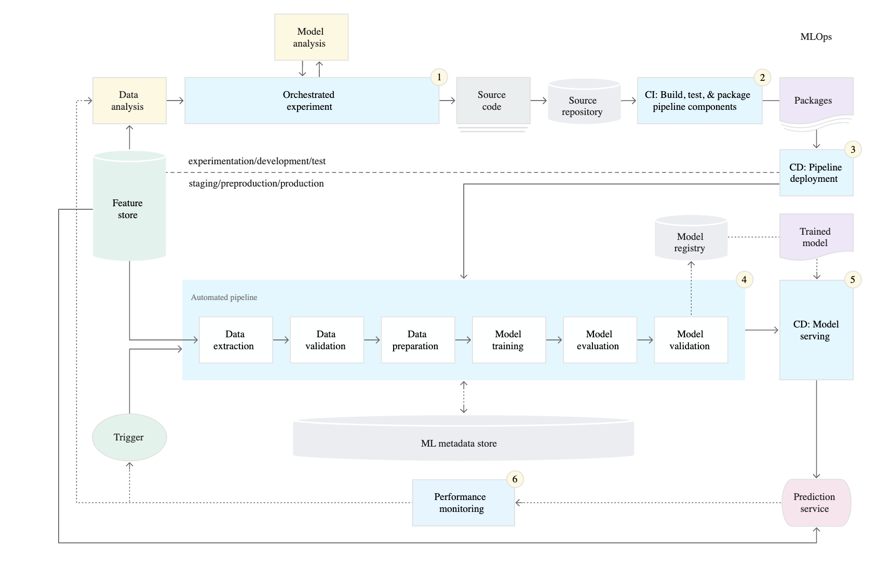
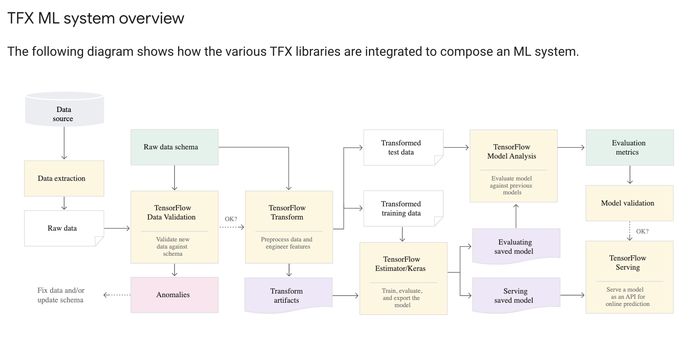

# MLOps

Machine learning operations (Machine Learning Model Operationalization Management). Like DevOps, but instead of CI/CD, this is for data pipelines, training/deploying models, monitoring data and models.


---

# Insane number of options and components


---

# Parts of MLOps

<div class="grid grid-cols-2 gap-4">

<div>

## From [awesome-mlops](https://github.com/kelvins/awesome-mlops)


</div>

<div>

## Components

Basically the whole DS pipeline other than business understanding

- Data collection, cleaning, pipelines
- ML: feature engineering/selection, model training, AutoML, model lifecycle and deployment
- model monitoring
- ML CI/CD

</div>

</div>

---

# Noah Gift's book

Podcast on MLOps: https://www.se-radio.net/2022/07/episode-522-noah-gift-on-mlops/

Book and Repo: https://github.com/paiml/practical-mlops-book

---

# [Google's article on MLOps](https://cloud.google.com/architecture/mlops-continuous-delivery-and-automation-pipelines-in-machine-learning)

## CI/CD/CT (continuous integration, development, and testing)

- CI is no longer only about testing and validating code and components, but also testing and validating data, data schemas, and models.
- CD is no longer about a single software package or a service, but a system (an ML training pipeline) that should automatically deploy another service (model prediction service).
- CT is a new property, unique to ML systems, that's concerned with automatically retraining and serving the models.

---

# DS steps in MLOps

Can be manual or automated with tools:

1. Data extraction - get and integrate data from sources
2. Data analysis - EDA, descriptive stats
3. Data preparation - feature engineer, create train/val/test splits
4. ML Model training - select best model from many
5. Model evaluation - evaluate performance on test set
6. Model validation - model is good enough for production, better than baseline
7. Model serving: REST API microservice, embedded model (edge device), batch prediction system
8. Model/adat monitoring - if performance drops or data stats change, retrain model

---

# MLOps levels

- 0: manual process, maybe script or notebook-based. Run each step by hand (data collection, prep, training, serving, etc)
- 1: ML pipeline automation: training, evaluation, and deployment of model is automated - optional feature store component
This setup is suitable when you deploy new models based on new data, rather than based on new ML ideas.

- 2: CI/CD pipeline automation
enables you to automatically test and deploy new pipeline implementations

feature store: a centralized place for storing features created from data - data can be collected in batches for EDA/dev work, served to live models in production, and provided to pipelines for creating training/val/test data

Tink in in between 1 and 2.

---

# MLOps level 2 diagram



* almost everything automated, but not EDA and model analysis

---
# Google's solution: [TFX - tensorflow extended](https://www.tensorflow.org/tfx/guide)

<div class="grid grid-cols-2 gap-4">

<div>
- "an integrated ML platform for developing and deploying production ML systems"
- modeling, training, validation, serving inference, and managing deployments
- can be used with kubeflow, airflow, etc
</div>

<div>


</div>
</div>

---
# Typical TFX ML system



---

# TFX ML system on GCP


---

# Google resources on MLOps

[Practicioners guide white paper](https://services.google.com/fh/files/misc/practitioners_guide_to_mlops_whitepaper.pdf)

[TFX, Cloud Build, Kubeflow ML Ops Archicture Guide](https://cloud.google.com/architecture/architecture-for-mlops-using-tfx-kubeflow-pipelines-and-cloud-build)

---

# Noah Gift, Alfredo Deza book - Practical MLOps
MLOps needed to automate ML, like DevOps for software dev

Mazlow's heirarchy of ML:

- DevOps
- Data Automation/Engineering
- Platform Automation
- MLOps
- Machine learning system

%25 of each:
- devops
- data
- models
- business

---

# CI - continuous integration

Continously test and add code
E.g. can use a makefile to automate steps, like:
- make install (e.g. install Python libraries)
- make lint - check code formatting
- make test - test code

Can be done with cloud automation, such as github actions, jenkins, buildkite, etc

Also first need a python virtualenv with requirements.txt

---

# CD - continuous deployment

Push to production using automated build tools:
- docker containers, kubernetes
- push to staging, load test
- push to production and serve

---
# DevOps

Foundation for MLOps. First need automated testing / CI. With Python, need a project scaffold:


[Example here](https://github.com/noahgift/github-actions-demo)

---
# Makefile
Makefile reduces work/errors, instead of `pylint --disable=R,C *.py` you can type `make lint` if you have 

```
lint:
    pylint --disable=R,C hello.py
```

In your makefile.

---

# CD - continuous deployment/delivery


Use CD and IaC to push things like ML project into production.

Load test with e.g. `locust` or `loader io`

---

# DataOps

Data engineering, e.g. airlfow, AWS Glue (serverless ETL), etc, to automate ETL, feature stores, data processing/exports

Airflow, AWS Data Pipeline, AWS Glue, etc

Can use athena, quicksight, etc to query/viz data.

Often use a data lake, like S3 to store data for good I/O characteristics.

---

# Platform automation

Like sagemaker, can automate many parts of the process. Can solve repeatability, scale, and operationalization problems.

---

# MLOps

With CI/CD (DevOps), DataOps, and platform automation in place, we can do MLOps. This partly consists of:
- train/retrain models
- deploy+version
- audit trail and artifacts (e.g. KPIs)
- monitor (then go back to the beginning with train/retrain)

---
# MLOps Foundations

- Bash/command line
- vim/nano/other bash editors
- cloud shells
- python
- math

---
# Cloud shells

Easier to do things all in the cloud to avoid data transfer

AWS - CloudShell, Cloud9 (more like IDE)

---
# vim and bash

configurations:
- awesome vim
- ohmyzsh

`shuf` command for quick sampling:

```
shuf -n 100000 en.openfoodfacts.org.products.tsv >\
10k.sample.en.openfoodfacts.org.products.tsv
```

---

# "the automator's law"

It turns out that the ability to harness computing power on data without
moving it, using near-infinite resources via machine learning platforms like
AWS SageMaker or Azure ML Studio, is the killer feature of the cloud not
replicable without cloud computing. Coupled with this killer feature is
something I call the “Automator’s law.” Once the general public starts
talking about automation of a vertical—self-driving cars, IT, factories,
machine learning—it eventually happens.

---
# "average is over" book by Cowen

chess software eventually beat humans, also proving
the Automator’s law in action. Surprisingly, though, at the end of Cowen’s
book, expert humans and chess software won versus chess software alone

---

# Python vs other languages for ML

"So it would be fair to say that Python’s performance got accidentally lucky
because of two things: cloud computing and containers. With Cloud
computing, the design is fully distributed, building on top of it using
technologies like AWS Lambda and AWS SQS (Simple Queuing Service).
Similarly, containerized technology like Kubernetes does the heavy lifting
of building distributed systems, so Python threads become suddenly
irrelevant." Python designed to be dev-friendly while other languages (C) designed to be machine-optimized/friendly.

Python is 64,000 times slower than equivalent matrix operations in C. This fact is in addition to not having
true threads.

many operations in Python require 50 times more energy than equivalent operations in C ([paper](https://greenlab.di.uminho.pt/wp-content/uploads/2017/09/paperSLE.pdf)).

---


---

---

# Chapter 12. Machine Learning - Engineering and MLOps Case Studies

Noah Gift built Sqor sports social network
Predicted traffic to site based on features from athlete influencers
- wiki page views
- twitter retweets
- facebook likes

Post on their site, cross-post on twitter, fb with link back to their site. Paid per view on their site. Eventually FB shut them down, laywers said "we will deplatform you".

---

# Learnings, advice from Noah and others

Models of how things work in the "perfect world" don't apply to real-world. We simplify situations to teach, making them predictable and easy.

Piero Molino - developed Ludwig at Uber to quickly make prototypes.

Infrastructure, monitoring more important than the actual ML. ML model in prod can effect data distribution.

Fairlearn, intrepretML for ML fairness and ethics.

CreateML and Ludwig autoML solutions.

# Advice from Authors

- Get certified on cloud platforms and with ML specialization
- Automate from the start, e.g. with CI
- Kaizen - continuous improvement
- Try to use platforms like AWS, GCP
- Most complex models not always best
- Use enterprise support for platform and have regular audits of archicture and practices for cybersecurity and data governance

# Best practices for data governance and cybersecurity

- PLP, principle of least privelage
- encrypt data at rest and in transit
- assume non-automated systems are insecure
- use cloud platforms for shared security model
- enterprise support, quarterly arch and security audits
- train staff on platforms and get certified
- quarterly and yearly training on new tech and best practices


# Recommender MLOps design patterns

- CaaS, container-as-a-service, PaaS (platform)
- MLOps platform - SageMaker, ML Studio, Vertex AI
- Serverless
- Spark-centric (databricks, EMR)
- Kubernetes-centric


---
---

# Appendix - working from home tips

Helps to have a stable, permenant home office.
Requirements:
- stable network - go for fiber since it has high up/down speeds
    - plug in directly with network switch and cat6 cables
    - can also use mesh wifi 6
- reliable power
    - have some backup battery, possibly solar/wind/etc
    - UPS for critical equipment
- standing desk, kettlebells, eliminate corporate junk food
- virtual work background, make it appealing

---

# Appendix - VC thinking for career

- spread out your 'investments' with multiple revenue/companies

PPEAR - passive, positive, exponential, autonomy, rule of 25%

---

# Appendix - projects

- GH or similar project with readme
- 100% repeatable jupyter notebooks
- original work
- 5-minute demo video showing how it works
- demo should be technical and teach how to do it step-by-step

notebook can be broken down into ingest, EDA, modeling, conclusion

Project ideas:
- Continuous Delivery of Flask/FastAPI Data Engineering API on a PaaS Platform
- Docker and Kubernetes Container
- Serverless AI Data Engineering Pipeline
- Build Edge ML solution
    - Intel Movidius Neural Compute Stick 2
    - AWS DeepLens
    - Coral AI
    - SmartPhone (iOS, Android)
    - Raspberry Pi
- Build Cloud Native ML Application or API

# Appendix - software careers

Find a backdoor, usually a less prestigious job title to break in.
Similar to musician, athlete - "love of suffering" and willingness to fail often.
Create your own 20% time - set aside a few hours a day to learn new things for self-development.
Embrace mistakes.
Find parallel hobbies to test your learning - rock climbing and Jiu Jitsu can be good.

---
# Appendix - nutrition

YAGNI - you ain't gonna need it
Complexities in food/nutrition not really needed.
- body increases nutrient absorbtion when levels are low
- You don’t need to eat breakfast or snacks
- don't need to eat many times a day
- don't need ultraprocessed foods

---

# Other stuff by Noah Gift

Pragmatic Labs on Oreilly, website, youtube, coursera course https://www.coursera.org/specializations/building-cloud-computing-solutions-at-scale

Other books

---

# Appendix - better education

- 

---

# Books that looked interesting to me referenced in this book

- How Breakthroughs Happen
- machine learning for time series forecasting with python